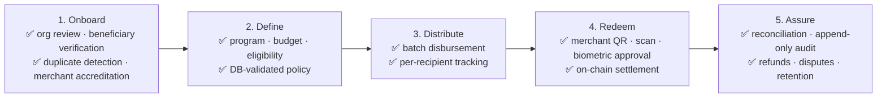

# Business Requirements Document (BRD): ReliefChain

**Project:** ReliefChain — Blockchain-Powered Disaster Relief Distribution Platform  
**Date:** 2026-09-24  
**Version:** 1.0  
**Owner:** MINDMESH  
**Status:** Active  
**Source of truth:** [`relief-chain.md`](relief-chain.md)  
**Related:** [BPD](bpd-reliefchain.md) · [PRD](prd-reliefchain.md) · [SAD](sad-reliefchain.md) · [SDD](sdd-reliefchain.md) · [DSD](dsd-reliefchain.md) · [Flow](flow-reliefchain.md) · [Build](build-reliefchain.md)

---

> **Source-of-truth rule.** [`relief-chain.md`](relief-chain.md) is the canonical foundation document. Resolve conflicts there first, then propagate. Read `relief-chain.md`, then the rest of `docs/`, before reading code.
>
> **This version supersedes the "ReliefGuard AI" BRD.** That document described a four-phase AI platform (Predict → Prepare → Respond → Recover) with flood forecasting, fraud-detection models, GIS heatmaps, market sizing, pricing tiers, and three-year revenue projections. **None of that is supported by the current proposal or the codebase**, and several figures had no source. It has been removed rather than carried forward.
>
> **Evidence standard.** Every claim here is traceable to the written proposal, to code, or to an explicit team decision. Unsupported numbers are marked **Not validated**. Undecided items are marked **TBD**. No estimate is presented as measured.

**Status legend:** ✅ built · 🟡 partial, gated, or simulated · ⬜ planned, no code · ❌ out of scope

---

## 1. Executive Summary

### 1.1 What ReliefChain is

ReliefChain is a disaster relief distribution platform for governments and humanitarian organizations. An organization creates a relief program, registers and verifies beneficiaries, approves assistance, and disburses aid over Stellar. Accredited merchants redeem beneficiary QR invoices and receive on-chain settlement. Every financial movement is written against append-only audit, ledger, and reconciliation records.

It is **not** an AI platform. There is no prediction, forecasting, risk-scoring, or anomaly-detection model in the product or the repository.

### 1.2 Value proposition

> ReliefChain enables governments and humanitarian organizations to distribute secure, transparent, and programmable disaster assistance in minutes instead of days using the Stellar blockchain.

### 1.3 What the build actually delivers

The implemented system is a **financial-controls platform**: 54 tables, 40 enum types, 77 row-level-security policies, 79 triggers, four projection tables, append-only evidence tables, a two-phase prepare/submit transaction protocol, idempotency-key claiming, reconciliation runs/issues/cursors, MFA with step-up, and retention plus identity-disposition workflows. Correctness and auditability are the product.

### 1.4 Operating boundary — read before any business claim

| Boundary | Detail |
|---|---|
| Network | **Stellar testnet only.** `shared/stellar-config.ts` throws `'Mainnet is hard-disabled for the pilot.'` |
| Asset | **RCPHP**, declared `'Testnet only — no real monetary value.'` |
| Cash-out | 🟡 **Simulated.** `scripts/test-cashout.mjs` simulates external transitions |
| Deployment | 🟡 **Hosted Supabase testnet demo environment is live** (52 migrations, 13 Edge Functions, demo accounts) — but no release signing, monitoring, or production secret management ([build](build-reliefchain.md) §15.0, SETUP.md §13) |
| Pilots | ❌ No LGU, agency, or NGO has deployed, piloted, procured, or endorsed ReliefChain |

**No revenue has been earned, no customer has been signed, and no aid has been distributed with real value.**

---

## 2. Business Problem

From the written proposal. These are the product's premises, **not** independently verified research — the proposal supplies no statistics, citations, or baselines, and none are invented here.

| Problem | Business impact |
|---|---|
| Manual beneficiary verification | Slow processing, heavy administrative effort |
| Duplicate registrations | Aid counted or claimed more than once |
| Slow aid distribution | Assistance arrives later than households need it |
| Cash handling risk | Security and accountability exposure in physical distribution |
| Limited transparency | Organizations and funders cannot trace program progress |
| Difficult auditing | Reconstructing distribution activity is burdensome |
| Fraudulent claims | Aid diverted from intended beneficiaries |
| Poor connectivity in disaster areas | Online-only systems stop working when they are needed most |
| Limited beneficiary communication | People do not learn that assistance is available |

**Category distinction.** A general digital wallet moves money but does not manage the relief lifecycle — program definition, eligibility, purpose restriction, merchant accreditation, reconciliation, or audit. That gap is ReliefChain's reason to exist.

> **Removed claims.** The previous BRD asserted "20+ typhoons per year", "₱50–₱100 billion annual damage", "60% of the population in flood-vulnerable areas", "8–15% of relief funds lost to fraud", and "12–18% administrative overhead". These may well be directionally true, but no source was ever cited. Do not reuse them until each is attributed to a named, dated source.

---

## 3. Business Solution — The Actual Lifecycle

No pre-disaster prediction phase exists. The lifecycle begins when an organization decides to run a program.

---

## 4. System Roles

Three roles exist in code (`src/utils/auth-routing.ts`). There is **no donor role**.

### 4.1 LGU / Organization ✅

- **Represents:** LGU administrators, NGO program managers, DRRMO officers
- **Tabs:** Dashboard · Programs · **Disbursements** (route `pay-scan`) · Beneficiaries · Settings
- **Capabilities:** create and fund programs through a seven-step wizard; verify and re-verify beneficiaries; run batch disbursements with per-recipient outcomes; monitor budget and activity
- **Gate:** organization registration passes a review state machine before dashboard access
- **Security:** Supabase Auth plus RLS; MFA and step-up on sensitive financial actions

### 4.2 Merchant ✅

- **Represents:** accredited groceries, pharmacies, hardware stores, school-supply retailers
- **Screens:** Dashboard · Receive · Programs · Profile · Security (a `Stack` with a custom bottom bar)
- **Capabilities:** accreditation per program; generate signed QR invoices; accept redemption; view settlements and metrics; request cash-out (🟡 simulated); process refunds
- **Security:** accreditation must be active and valid at invoice issue time, and the invoice settlement wallet must match the merchant's verified wallet

### 4.3 Beneficiary ✅

- **Represents:** verified disaster-affected individuals and households
- **Tabs:** Dashboard · My Assistance · Pay/Scan · Find Organization · Profile (Transactions and Wallet Recovery are hidden routes)
- **Capabilities:** register and resubmit; hold a device-custodied Stellar wallet; view entitlements and balance; scan merchant QR; approve payment biometrically; recover a wallet
- **Security:** wallet secret in `expo-secure-store`; biometric approval with an explicit fallback so no device locks a user out; wallet bound to identity by proof of possession

### 4.4 Auditor 🟡 and Donor ⬜

Auditor access exists as controlled RPCs (`auditor_view_approvals`, `auditor_view_reconciliation_report`, `auditor_view_identity_mappings`, `auditor_view_dispute_evidence`) plus the `public_financial_transparency` view and `public_program_aggregate_projection` table — **data only, no UI**. A donor role does not exist.

---

## 5. Stakeholders

Everyone below is a **prospective** stakeholder. No agreement, integration, endorsement, or procurement exists with any named entity.

| Category | Prospective entities | Interest |
|---|---|---|
| Government | DSWD, LGUs (provincial, city, municipal), DRRMOs | Faster response, traceability, audit readiness |
| Humanitarian | Philippine Red Cross, UNICEF, World Vision, Save the Children, faith-based organizations | Verifiable delivery, reduced duplication, donor reporting |
| Merchants | Groceries, pharmacies, hardware stores, school-supply retailers | Settlement without cash handling, post-disaster sales |
| Beneficiaries | Disaster victims, senior citizens, PWDs, farmers, fisherfolk, low-income households | Fast assistance, dignity, clear balance |
| Oversight | Auditors, funders | Verifiable trail without beneficiary personal data |
| Technology | Stellar Development Foundation, Supabase, licensed PH VASPs | Adoption, integration, eventual fiat liquidity |

> **Removed claims.** The previous BRD listed PAGASA, UP NOAH, MMDA, Puregold, SM Markets, Mercury Drug, Generika, Coins.ph, Maya, and PDAX in a "partnership architecture". Naming a target is not a partnership. Weather and hydrology providers are irrelevant now that prediction is out of scope.

---

## 6. Business Requirements with Status

### BR-01 Organization onboarding with review ✅
Organizations self-register and pass a review state machine before operating. Registration status transitions are guarded in the database; denials are logged; resubmission is supported without limit.

### BR-02 Relief program management ✅
Create a program with budget, aid type, eligibility, geography, documents, schedule, and voucher policy. Financial policy is validated by a database trigger, not only by the client. Policy changes append immutable events.

### BR-03 Beneficiary verification ✅
Registration captures identity and household evidence. Verification and re-verification decisions are recorded append-only.

**Evidence sources named in the proposal:** National ID, Barangay Certificate, DSWD records, household information. **These are captured as submitted evidence. There is no live government system integration** — no PhilSys, DSWD, SSS, PhilHealth, or BIR connection exists.

### BR-04 Duplicate prevention ✅
Enrollment is scoped to a `beneficiary_identities` record and a disaster-response campaign. A second enrollment for the same identity in the same campaign is rejected **by the database**, not by UI validation.

This is a real control. It is **not** a claim of zero fraud — see §9.

### BR-05 Merchant accreditation ✅
Merchants are accredited per organization and program with a validity window. Redemption requires an active accreditation valid at invoice issue time.

### BR-06 Wallet provisioning and custody ✅
Wallets are provisioned through the two-phase protocol. The device holds the secret in secure storage; the server never holds a beneficiary key. Address-to-identity binding requires a proof-of-possession challenge. Rotation and recovery are supported.

### BR-07 Aid disbursement ✅ (cash rail)
Batch disbursement creates a job plus per-recipient rows, executes prepare then submit, and defers confirmation to reconciliation. Failures are reported per recipient and are retryable.

### BR-08 Purpose-restricted vouchers 🟡 built, gated
The Soroban `VoucherContract` enforces one immutable instance per program, conservation invariants on every value change, merchant category and signature checks, per-transaction and rolling daily limits, one-time nonces, non-seizing pause/resume, and rotation that cannot reset limits.

**It is unreachable from the app.** `supabase/functions/prepare-payment/index.ts` rejects any `fundingSourceKind !== 'cash'` — *"Only cash funding source is supported in MVP."* State the capability as built, tested, and gated. Do not describe purpose restriction as operating today.

### BR-09 Merchant QR redemption ✅
Merchant issues a signed invoice; beneficiary scans and approves biometrically; the server validates identity, enrollment, verified wallet, accreditation, settlement-wallet match, and numeric safety before returning an unsigned signing package. Amounts beyond safe-integer range **fail closed**.

### BR-10 Reconciliation and audit ✅
Reconciliation polls Horizon from durable cursors, ingests ledger transactions, records issues, and updates projections. Confirmed workflow states require linked chain evidence by trigger. Audit, ledger, contract-event, and evidence tables are append-only.

### BR-11 Refunds, disputes, cash-out ✅ / 🟡
Refunds and disputes with evidence are implemented, including a contract-level refund capped at the original redemption. Merchant cash-out creates a request; **external settlement is simulated** and labeled as such in the UI.

### BR-12 Data protection and retention ✅
Beneficiary personal data stays in Postgres under RLS. Retention policies, legal hold, and a reviewed identity-disposition workflow exist. Chain-facing records and contract events are pseudonymous. **No beneficiary personal data is placed on-chain.**

### BR-13 Beneficiary notification ⬜
SMS notification on assistance release is planned as **partial scope**. No SMS package, provider, or code exists.

### BR-14 Offline continuity ⬜
Bluetooth offline synchronization is planned as a **full build**. No BLE dependency and no code exist; Android permissions are CAMERA and RECORD_AUDIO only. It is a new architectural tier requiring offline authority and revocation, balance reservation, replay protection, and deterministic conflict resolution before it has acceptance criteria.

### BR-15 Public and donor transparency 🟡 / ⬜
Transparency data exists without a UI. A donor-facing view is planned as partial scope, with privacy thresholds undecided.

### BR-16 Analytics and reporting ⬜
Projections and auditor RPCs exist; no charting or export interface does.

### Out of scope ❌
AI prediction, fraud-detection models, risk scoring, GIS heatmaps, smart resource planning, mainnet or real funds, production deployment (release signing, monitoring, incident response — the hosted *testnet demo* environment does exist), web dashboards for all roles, real fiat on/off-ramp, IoT sensors, localization beyond English, non-flood disaster specialization.

---

## 7. Technology Stack

Declared versions from `package.json`. Full detail in [SAD](sad-reliefchain.md) §2.

| Layer | Technology |
|---|---|
| Client | Expo SDK `~57.0.4`, React Native `0.86.0`, React `19.2.3`, TypeScript `~6.0.3` |
| Routing | `expo-router` `~57.0.4`, typed routes, role-based route groups |
| Blockchain | `@stellar/stellar-sdk` `^16.0.1`; Rust + `soroban-sdk` contract (`#![no_std]`) |
| Backend | **13** Supabase Edge Functions (Deno), two-phase prepare/submit |
| Data | Supabase Postgres + Auth, 52 migrations, RLS, triggers, projections |
| Device | `expo-camera`, `react-native-qrcode-svg`, `expo-secure-store`, `expo-local-authentication` |
| UI | `@expo/ui`, `react-native-reanimated` `4.5.1`, Plus Jakarta Sans, Sarina |
| Tests | `node --test`, `fast-check` property tests, `supabase test db` — **no jest, no vitest** |

**Corrections to the previous BRD:** there are 13 Edge Functions — 12 in the repo plus `lgu-signup`, whose source was recovered from the hosted project on 2026-09-24; there is no AI/ML layer; Supabase Storage document upload should be verified before it is claimed; and clawback is **not** verified in the current contract — do not assert it.

### Why Stellar

The proposal's stated reasons: settlement in seconds, very low fees, a secure ledger, wallet integration, transparency, and interoperability.

**Not benchmarked.** No latency, fee, or throughput measurement exists for this workload, and no comparison against another chain was performed. The previous BRD's comparison table against Ethereum and Bitcoin cited no source and has been removed.

---

## 8. Business Model

**Known:** a transaction fee of approximately **1%** is intended to fund ongoing maintenance.

**Undecided:** who remits it, whether it applies to disbursement, redemption, or both, refund and reversal treatment, cash-out pricing, minimums and caps, non-fee revenue, and procurement implications of charging a public body.

The previous SaaS tiers (₱150,000–₱600,000 per year), the 0.5% fee, and the three-year projections are removed — they conflict with the stated 1% fee and had no basis. Detail and the decision list: [BPD](bpd-reliefchain.md) §4.

---

## 9. Competitive Position

From the proposal, reproduced as **positioning, not validated market analysis**. The proposal names no competitor, criteria, evidence, or date.

| Capability | Traditional response | Generic digital wallet | ReliefChain |
|---|:---:|:---:|:---:|
| Relief program management | Limited | No | ✅ |
| Beneficiary verification | Manual | No | ✅ |
| Duplicate prevention | Manual | No | ✅ DB-enforced |
| Blockchain distribution | No | Limited | ✅ testnet |
| Purpose-restricted vouchers | No | No | 🟡 built, gated |
| QR merchant redemption | No | Generic | ✅ invoice-validated |
| Reconciliation + append-only audit | Manual | No | ✅ |
| Retention + identity disposition | Manual | No | ✅ |
| Offline continuity | No | No | ⬜ planned |
| Beneficiary SMS | Limited | Limited | ⬜ planned |
| Donor transparency | No | No | ⬜ planned |

**Where the real differentiation sits today:** database-enforced duplicate prevention, the two-phase protocol with device-side signing, chain-evidence coupling, append-only audit, and contract-level conservation invariants. That is a stronger and more defensible story than the unbuilt features — lead with it.

> **Removed claims.** "0% fraud (cryptographic)", "~2,000x faster", "85% cost reduction", and the ₱1.3M savings case example were arithmetic on unsourced baselines. Duplicate *enrollment* is prevented; that is not the same as eliminating fraud, which includes collusion, coercion, identity fraud at intake, and merchant-side abuse.

---

## 10. Compliance and Risk

### 10.1 Compliance posture — intent, not attestation

| Area | Intent | Reality |
|---|---|---|
| BSP / e-money | Closed-loop relief tokens redeemable only at accredited merchants | **No legal review, no ruling, no licence.** RCPHP is a testnet asset with no value, so no regulated activity occurs today |
| Data Privacy Act (RA 10173) | Personal data under RLS with retention, legal hold, and disposition; pseudonymous on-chain records | Controls exist in code. **No privacy impact assessment, DPO review, or NPC registration** |
| Audit readiness | Append-only evidence with ledger linkage | Structurally supports audit. **No auditor has reviewed or accepted any export format** |
| Procurement (RA 9184) | Emergency modalities may apply | **Not assessed by counsel** |

Do not describe ReliefChain as compliant, exempt, or certified. Describe the controls, and name the reviews that have not happened.

### 10.2 Risk register

Probability and impact are team judgment, not measured.

| Risk | Impact | Mitigation status |
|---|---|---|
| Regulatory treatment of the token and fee | High | ⬜ No legal review — the top pre-production gate |
| No offline capability despite it being a headline claim | High | ⬜ Design decisions open (BR-14) |
| Voucher differentiator unreachable | High | 🟡 Built and tested; needs gate lift plus admin-secret provisioning |
| Cash-out is simulated, so merchants cannot be paid in fiat | High | 🟡 Requires a licensed partner; none engaged |
| Business model undefined | High | 🟡 Only the ~1% fee is decided |
| A dev migration disables wallet-binding protection if applied to a shared environment | High | ⚠️ Open — `build-reliefchain.md` §8 item 1 |
| No monitoring, alerting, or incident response | Medium | 🟡 A hosted testnet environment now exists; observability and on-call do not |
| Unproven capacity at disaster scale | Medium | ⬜ No load testing |
| Beneficiary device loss or biometric unavailability | Medium | ✅ Rotation, recovery, and explicit fallback implemented |
| Merchant adoption | Medium | ⬜ No merchant engaged |
| Administration turnover at a partner LGU | Medium | ⬜ No LGU engaged |

---

## 11. Success Metrics

**No metric has a measured baseline or an agreed target.** The proposal supplies qualitative outcomes only, and there is no production environment to measure. Defining these is open work ([`relief-chain.md`](relief-chain.md) Q32).

| Candidate metric | Baseline | Target |
|---|---|---|
| Time from approval to beneficiary credit | TBD | TBD |
| Share of budget reaching beneficiaries | TBD | TBD |
| Redemption rate within a program window | TBD | TBD |
| Duplicate-enrollment attempts blocked | Measurable in-system | TBD |
| Reconciliation exceptions per 1,000 transactions | Measurable in-system | TBD |
| Merchant settlement confirmation time | TBD | TBD |
| Audit export generation time | TBD | TBD |

Before any target is published, define the measured event boundary — Edge acceptance, Horizon submission, ledger close, and reconciliation confirmation are seconds apart and not interchangeable.

The previous BRD's targets (under 15 minutes, over 97.5%, over 90% prediction accuracy, ~0% fraud, under 5 seconds, under 1 minute) had no baseline and, in the prediction case, no feature. Removed.

---

## 12. SDG Alignment

The proposal names six goals: **SDG 1** No Poverty · **SDG 9** Industry, Innovation and Infrastructure · **SDG 10** Reduced Inequalities · **SDG 11** Sustainable Cities and Communities · **SDG 16** Peace, Justice and Strong Institutions · **SDG 17** Partnerships for the Goals.

These are stated alignments. No outcome indicator, measurement method, or reporting commitment exists. SDG 13 (Climate Action) was claimed in the previous BRD on the strength of flood prediction; with prediction out of scope, that claim is withdrawn.

---

## 13. Open Business Decisions

| # | Decision | Owner | Blocks |
|---:|---|---|---|
| 1 | Fee mechanics — payer, base, refunds, caps | MINDMESH | Business plan, procurement |
| 2 | Legal review of the token, fee, and identity handling | Counsel, not engaged | Any production use |
| 3 | Fiat off-ramp partner | MINDMESH | Real merchant settlement |
| 4 | Offline design decisions | Engineering | BR-14 |
| 5 | Donor model — accounts or anonymous view, privacy thresholds | MINDMESH | BR-15 |
| 6 | Measured metric definitions and targets | MINDMESH | §11 |
| 7 | First pilot organization | MINDMESH | Every validation claim |
| 8 | Voucher rail unlock plan | Engineering | BR-08 |

Full question set: [`relief-chain.md` §14](relief-chain.md).

---

## Self-Check

- [x] Renamed from ReliefGuard AI to ReliefChain; AI framing removed
- [x] Every requirement carries an as-built status with evidence
- [x] Unsourced statistics, savings, and ROI claims removed and flagged
- [x] Named entities described as prospective, not partners
- [x] Business model limited to the decided 1% fee
- [x] Compliance stated as intent with reviews named as outstanding
- [x] Metrics marked TBD rather than invented
- [x] Dead links to removed documents eliminated
- [ ] Legal, privacy, and procurement reviews outstanding
- [ ] No pilot, customer, or measured outcome exists
