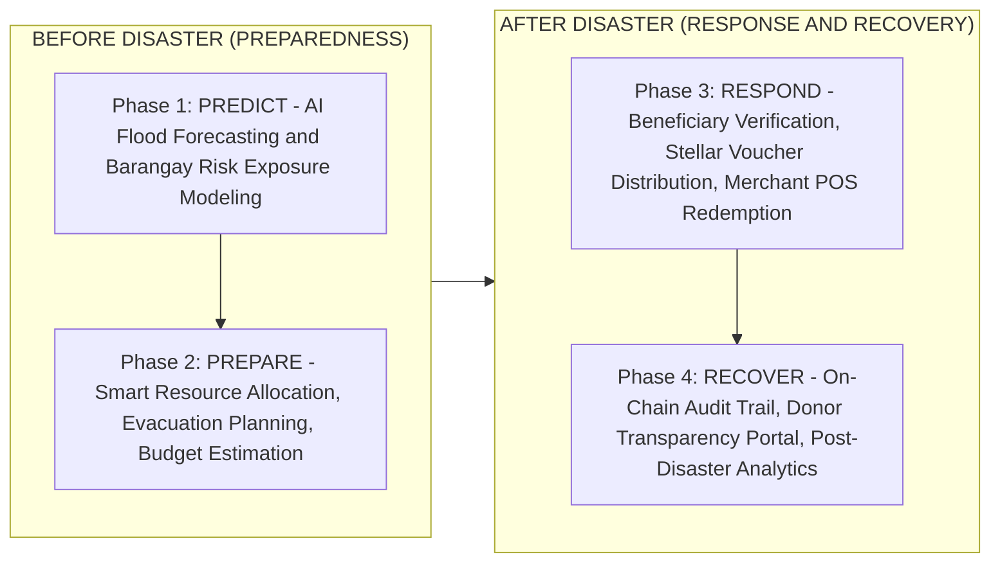
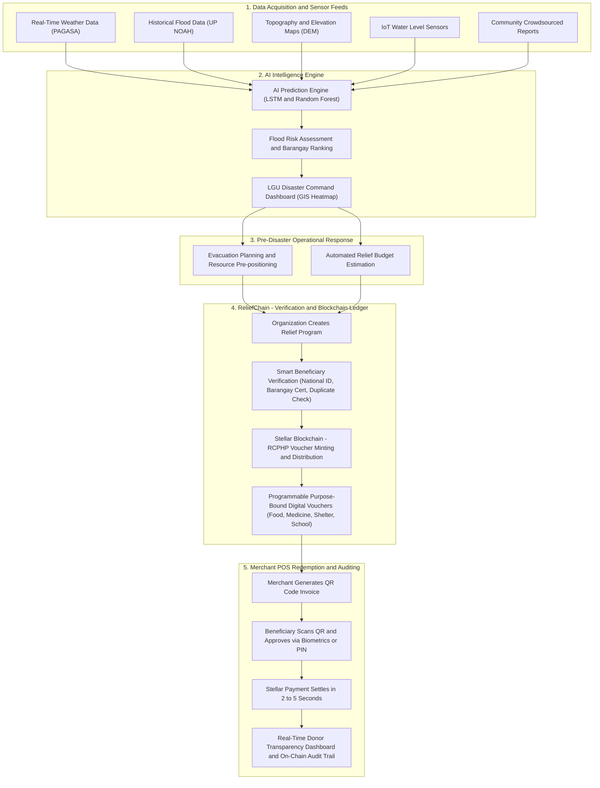

# Business Requirements Document (BRD)

**Project Name:** ReliefGuard AI  
**Subsystem:** ReliefChain (Blockchain Aid Distribution)  
**Document Version:** 2.0  
**Date:** July 2026  
**Document Owner:** ReliefGuard AI Product & Business Team  
**Status:** Approved — Hackathon Submission Baseline  
**Related Documents:** [PRD](prd-reliefchain.md) · [BPD](bpd-reliefguard.md) · [Project Overview](mindmesh-project-overview.md)  
**Hackathon:** [2026 PUP Hackathon: UtHack ang Puhunan](2026-pup-uthackathon.md) — Deadline July 31, 2026

---

## 1. Executive Summary

### 1.1 Platform Overview

**ReliefGuard AI** is an end-to-end disaster resilience platform that combines **Artificial Intelligence** and **Blockchain** to empower governments, local government units (LGUs), humanitarian organizations, and accredited merchants to act faster and more accountably before, during, and after natural disasters.

The platform operates across two connected subsystems:

- **Pre-Disaster Intelligence (Phases 1 & 2):** AI-powered flood prediction, community risk modeling, and automated resource planning to enable proactive preparedness before disaster strikes.
- **ReliefChain — Blockchain Aid Distribution (Phases 3 & 4):** A Stellar-powered programmable voucher and beneficiary management system that replaces slow, paper-based cash relief with instant, traceable, purpose-bound digital aid.

Built for the Philippine context — a country averaging 20+ typhoons per year — ReliefGuard AI transforms fragmented, reactive disaster response into a unified, data-driven, and fraud-resistant system.

### 1.2 One-Line Value Proposition

> *ReliefGuard AI empowers LGUs and humanitarian organizations to predict flood risks before disasters strike and disburse transparent, fraud-proof digital financial aid in minutes instead of days.*

### 1.3 Key Value Drivers

| Driver | Impact |
| :--- | :--- |
| **Velocity** | Aid disbursement reduced from 7–14 days to under 5 minutes via Stellar network settlement |
| **Accountability** | On-chain cryptographic tracking eliminates middleman corruption and phantom recipient fraud |
| **Proactive Preparedness** | AI-driven early warnings replace reactive emergency spending with barangay-level flood depth forecasting |
| **Dignity & Local Economy** | Beneficiaries purchase essentials directly from accredited local merchants — stimulating post-disaster economic recovery |

---

## 2. Business Problem Statement

The Philippines is geographically situated in the Pacific Typhoon Belt and averages **20+ tropical cyclones** per year, with direct disaster damage exceeding **₱50–₱100 Billion annually**. Over **60% of the population** resides in flood-vulnerable coastal or low-lying areas. Despite this exposure, disaster management remains fragmented across two critical failure points:

### 2.1 Pre-Disaster Failures (The Preparedness Gap)

LGUs and DRRMOs operate on generalized weather forecasts that fail to provide actionable, localized intelligence:

| Problem | Business Impact |
| :--- | :--- |
| **No Barangay-Level Flood Modeling** | LGUs cannot pinpoint which communities to evacuate first |
| **Imprecise Flood Timing** | Late emergency warnings lead to preventable casualties |
| **Unclear Evacuation Routes** | No real-time intelligence on safe vs. submerged roads |
| **Guesswork Resource Planning** | Food pack and medical kit stockouts or dangerous oversupply |

**Consequence:** Delayed evacuations, misallocated relief supplies, increased human casualties, and compounding economic losses.

### 2.2 Post-Disaster Failures (The Distribution Gap)

Once disaster strikes, governments and NGOs face severe operational bottlenecks:

| Problem | Business Impact |
| :--- | :--- |
| **Manual Beneficiary Verification** | Paper lists and physical queues create bottlenecks lasting hours or days |
| **Duplicate Registrations & Fraud** | 8–15% of relief funds estimated lost to duplicate or fraudulent claims |
| **Slow Cash Disbursement** | Physical cash or bank checks take 7–14 days to reach victims |
| **Cash Handling & Security Risks** | Administrative and security costs consume 12–18% of total relief budgets |
| **No Spending Controls** | Physical cash cannot guarantee funds are spent on food and medicine vs. non-essentials |
| **Opaque Fund Tracking** | Donor trust erodes without real-time visibility into how relief funds are actually spent |
| **Inadequate Audit Trails** | COA reconciliation takes 3–6 months with paper receipts |
| **Standard Digital Wallets Insufficient** | Generic e-wallets transfer money but have no relief program context, voucher restrictions, or merchant verification capabilities |

---

## 3. Business Solution: 4-Phase Disaster Lifecycle

ReliefGuard AI unifies predictive intelligence with blockchain aid distribution across four operational phases:

| Phase | Description | Implementation Status |
| :--- | :--- | :---: |
| **1 — Predict** | AI models analyze PAGASA weather, UP NOAH flood history, IoT sensors, elevation maps, and community reports to estimate flood probability, timing, depth, and affected households at the barangay level. | 📋 Designed — Mock data for hackathon |
| **2 — Prepare** | System auto-recommends food pack volumes, medical kit counts, rescue team deployment, evacuation center activation, and estimated relief budgets prior to landfall. | 📋 Designed |
| **3 — Respond** | ReliefChain activates: Organizations create programs, verify beneficiaries, distribute RCPHP digital vouchers via Stellar, and monitor merchant QR redemptions in real time. | ✅ Implemented |
| **4 — Recover** | Platform tracks redemption rates, budget utilization, geographic coverage, and fraud metrics. Every transaction is permanently recorded on-chain. | ✅ Implemented (Donor Portal: 📋 Planned) |

---

## 4. End-to-End System Workflow

The following diagram represents the full data pipeline from weather intelligence through to donor transparency:

---

## 5. System Roles & Stakeholder Analysis

### 5.1 Application System Roles (RBAC)

The platform enforces strict Role-Based Access Control (RBAC) across three primary system roles, each with a dedicated mobile navigation layout:

#### Role 1: Organization
*Representing: LGU Administrators, NGO Program Managers, DRRMO Officers*

| Attribute | Details |
| :--- | :--- |
| **Access** | Administrative dashboard with full program, beneficiary, and disbursement management |
| **Navigation Tabs** | Dashboard · Programs · Beneficiaries · Pay/Scan · Settings |
| **Key Capabilities** | Create and manage relief programs, review and approve/deny beneficiary registrations, trigger batch Stellar disbursements, monitor real-time redemption progress and GIS heatmaps, view COA-compliant audit reports |
| **Auth Requirements** | JWT authentication + biometric/PIN gating for all financial operations |

#### Role 2: Merchant
*Representing: Accredited Local Retailers, Pharmacies, Hardware Stores, School Supply Shops*

| Attribute | Details |
| :--- | :--- |
| **Access** | Merchant POS mobile app with enrollment and QR generation capabilities |
| **Navigation Tabs** | Dashboard · Programs · Receive · Profile · Security |
| **Key Capabilities** | Browse and enroll in active relief programs, generate amount-specific QR codes, validate incoming beneficiary payments, receive instant Stellar settlement, view redemption history |
| **Auth Requirements** | PIN/biometric for QR generation and settlement actions |

#### Role 3: Beneficiary / End-User
*Representing: Disaster Victims, Heads of Household, Vulnerable Citizens*

| Attribute | Details |
| :--- | :--- |
| **Access** | Mobile citizen app for wallet management, voucher tracking, and QR payments |
| **Navigation Tabs** | Home · My Assistance · Transactions · Pay/Scan · Profile |
| **Key Capabilities** | Submit digital registration (National ID, Barangay Certificate, household info), hold custodial Stellar wallet, view aid balances and voucher categories, scan merchant QR codes, approve payments via biometrics |
| **Auth Requirements** | Biometric authentication mandatory for all payment approvals |

---

### 5.2 Stakeholder Ecosystem

| Stakeholder Category | Specific Entities | Primary Interests |
| :--- | :--- | :--- |
| **Government Agencies** | DSWD, NDRRMC, DILG, Provincial/City/Municipal LGUs, DRRMOs | Rapid emergency response, automated COA audit compliance, zero fund leakage, transparent public accountability |
| **Humanitarian Organizations** | Philippine Red Cross, UNICEF Philippines, World Vision PH, Save the Children, INGOs | Instant, verifiable aid delivery, reduction of duplicate aid distributions across agency programs, real-time impact reporting for donors |
| **Accredited Merchants** | Puregold, SM Markets, Mercury Drug, Generika, Barangay Sari-Sari Stores | Guaranteed instant Stellar settlement, surge in local post-disaster sales, simple QR-based acceptance without cash handling risks |
| **Beneficiaries / Citizens** | Disaster victims, Senior Citizens, PWDs, Farmers, Fisherfolk, Low-income households | Immediate financial aid, dignity of choice in purchasing essentials, transparent balance tracking, no physical queue |
| **Donors & Auditors** | COA, International Donor Agencies, Corporate CSR, General Public | Real-time on-chain verifiable audit trail, verified proof of impact, zero exposure of beneficiary PII |
| **Technology Partners** | Stellar Development Foundation (SDF), Supabase, Licensed PH VASPs (Coins.ph, Maya, PDAX) | Platform adoption, API integration, fiat liquidity and PHP conversion partnerships |
| **Data Partners** | PAGASA, UP NOAH, MMDA Flood Control | Weather API access, historical flood datasets, real-time river telemetry |

---

## 6. Detailed Business & Functional Requirements

The platform provides **13 core features** spanning the disaster management lifecycle. Each feature is listed with its current implementation status for the hackathon submission.

> [!NOTE]
> **Implementation Status Key:**  
> ✅ Implemented — Fully functional on Stellar Testnet  
> 🔨 In Progress — Partially implemented  
> 📋 Designed — UX designed; mock/simulated data for hackathon demonstration  

---

### Feature 1: AI Flood Prediction
**Status:** 📋 Designed — Mock/simulated data for hackathon

**Description:** Continuous automated barangay-level flood risk modeling using multi-source meteorological and hydrological data.

**Business Requirements:**
- Ingest data from PAGASA weather feeds, UP NOAH flood history, digital elevation models (DEM), IoT river sensors, and crowdsourced community reports.
- Predict: flood probability (%), expected rainfall trend, flood depth estimate (meters), expected timing of inundation, high-risk barangay list ranked by exposure, and number of affected households.
- Execute prediction algorithms using Long Short-Term Memory (LSTM) time-series neural networks and Random Forest classification models.
- Display AI confidence level and contributing factors per prediction (e.g., "Rainfall: 150mm/24hr + River Level: 2.3m above normal → 92% flood probability") for human-interpretable explainability.
- AI operates under a **human-in-the-loop** principle — LGU officers make all final decisions on evacuations and resource deployment; AI does not act autonomously.

---

### Feature 2: Disaster Risk Dashboard
**Status:** 📋 Designed

**Description:** Interactive GIS command center for LGU and DRRMO emergency decision-makers.

**Business Requirements:**
- Display high-resolution flood probability heatmaps overlaid on local barangay administrative boundaries.
- Highlight vulnerable communities, population-at-risk counts, active evacuation center status, open vs. submerged evacuation routes, and live weather layer conditions.
- Track real-time positions and readiness levels of deployed rescue teams and response vehicles.

---

### Feature 3: Smart Resource Planning
**Status:** 📋 Designed

**Description:** AI-driven recommendation engine converting predicted flood impact into precise operational logistics for pre-disaster resource pre-positioning.

**Business Requirements:**
- Automatically translate flood severity predictions and estimated affected household counts into specific procurement and deployment quantities.
- Output: Number of Food Packs, Water Kits, Medical Kits, Rescue Teams, Temporary Shelter capacities, and total Required Disaster Budget in PHP.
- **Example:** 95% Flood Probability + 980 Estimated Affected Households → System recommends 980 Food Packs, 980 Water Kits, ₱4.9M Food Voucher Budget, 5 Evacuation Centers, 2 Medical Teams.

---

### Feature 4: Disaster Relief Program Management
**Status:** ✅ Implemented

**Description:** Full-lifecycle management suite for financial aid campaigns managed by the Organization role.

**Business Requirements:**
- Enable Organizations to create relief programs in minutes with: Program Name, Disaster Event Type, Total Budget (PHP), Per-Beneficiary Assistance Amount, Target Household Count, Voucher Category Type, and Eligibility Window.
- Maintain dynamic real-time budget tracking — remaining budget auto-decrements as distributions are committed and confirmed on-chain.
- Program dashboard displays: Total Allocated, Total Distributed, Remaining Budget, Verified Beneficiary Count, and Distribution Progress (%).
- Support program status lifecycle: Active → Distributing → Closed.

**Acceptance Criteria (from PRD US-01):**
- Given I am an authenticated Organization user, when I create a program with valid parameters, then the program appears in the programs list with status "Active" and remaining budget equals total budget.
- Given a program exists, when I view its details, then I see real-time distribution metrics updating via Supabase Realtime without manual refresh.

---

### Feature 5: Smart Beneficiary Verification
**Status:** ✅ Implemented

**Description:** Multi-layered verification pipeline ensuring aid reaches only legitimate, eligible disaster victims.

**Business Requirements:**
- Accept beneficiary registration submissions including: Full Name, Contact Number, Barangay, National ID (PhilSys), Barangay Certificate of Indigency, and Household Member Information.
- Support document image upload via Supabase Storage for personnel review.
- Perform automated duplicate detection — prevent the same individual or household from registering under multiple entries across programs.
- Generate AI Vulnerability Risk Score per applicant based on household data, barangay risk zone, and historical disaster records (📋 Designed).
- Organization personnel can Approve, Deny (with scoped reason), or Request Resubmission per application.
- Beneficiaries receive in-app notification on status change and can resubmit corrected applications.
- Upon approval, a custodial Stellar wallet is automatically provisioned with RCPHP trustline.

**Acceptance Criteria (from PRD US-02):**
- Given I complete registration, then my application is submitted for review with status "Pending."
- Given my application is approved, then I receive a notification and my Stellar wallet is auto-provisioned.
- Given my application is denied, then I see a specific scoped denial reason and can resubmit corrected information.

---

### Feature 6: Blockchain Aid Distribution
**Status:** ✅ Implemented

**Description:** One-click batch execution of financial assistance disbursements on the Stellar Testnet network.

**Business Requirements:**
- Upon Organization confirmation, execute automated batch RCPHP transfers directly to approved beneficiary Stellar wallets.
- Achieve settlement in 2–5 seconds per transaction with fees below $0.00001 per disbursement.
- Implement **prepare-then-submit pattern**: `prepare-disbursement` Edge Function validates and builds the Stellar transaction envelope; `submit-disbursement` function signs and submits to the network — ensuring idempotency and preventing double-disbursement on retry.
- Distribution confirmation screen shows: Number of Recipients, Amount Per Person, Total to be Distributed — requiring explicit Organization confirmation before execution.
- Per-beneficiary failure handling: display which beneficiaries received funds and which failed, with ability to retry individual failures.
- **Demo Mode:** Simulated blockchain settlement bypasses Stellar Testnet latency for live presentation scenarios while preserving the full UX flow.

---

### Feature 7: Programmable Digital Vouchers
**Status:** ✅ Implemented

**Description:** Purpose-restricted digital vouchers enforced at the application and Stellar asset layer, ensuring aid is spent only on approved categories.

**Business Requirements:**
- Issue RCPHP-denominated vouchers bound to specific merchant category types:

| Voucher Type | Emoji | Redeemable At |
| :--- | :---: | :--- |
| Food Voucher | 🍚 | Accredited grocery stores and food supply points only |
| Medicine Voucher | 💊 | Accredited pharmacies and medical clinics only |
| School Supply Voucher | 🎒 | Accredited educational supply retailers only |
| Shelter Assistance Voucher | 🏠 | Accredited hardware stores and construction material suppliers only |

- Reject redemption attempts at merchant categories not matching the voucher type at the application layer.
- Voucher balance and category displayed clearly in Beneficiary wallet home screen.

---

### Feature 8: Merchant Redemption (QR POS Payment)
**Status:** ✅ Implemented

**Description:** Frictionless QR-based point-of-sale payment settlement between Beneficiaries and Merchants via the Stellar network.

**Business Requirements:**
- Merchant enters purchase amount and generates an amount-specific QR code with an expiry countdown.
- Beneficiary scans the QR code and reviews: Merchant Name, Payment Amount, Voucher Type — before approving.
- Beneficiary approves via biometric authentication (fingerprint/Face ID) or PIN.
- Stellar blockchain validates voucher category eligibility and transfers RCPHP to the Merchant's wallet.
- Settlement completes in approximately 2–5 seconds on Testnet (2 seconds in Demo Mode).
- Both Beneficiary and Merchant receive instant confirmation with transaction reference and Stellar transaction hash.
- Expired QR codes show "Expired" status; Merchant can generate a new QR immediately.
- Insufficient balance: Beneficiary receives a clear error showing current balance vs. requested amount — payment is not submitted.

**Acceptance Criteria (from PRD US-04 / US-05):**
- Given I scan a valid QR, then I see Merchant name, amount, and voucher type before confirming.
- Given I approve with biometrics and the Stellar transaction completes, then I see "Payment Confirmed" and my balance decreases.
- Given a Merchant's QR expires without payment, then it shows "Expired" and a new one can be generated.

---

### Feature 9: AI Fraud Detection
**Status:** 📋 Designed

**Description:** Real-time anomaly detection engine monitoring registration and transaction patterns across the platform.

**Business Requirements:**
- Continuously analyze system events to detect: duplicate registrations across multiple programs, multiple wallet creations from a single device, suspicious redemption velocity (unusually high frequency or amounts), unaccredited merchant registrations, and identity data mismatches.
- Auto-flag high-risk events for Organization-role human review.
- Freeze suspicious funds prior to cash-out pending review outcome.
- No autonomous action on flagged items — all final decisions made by authorized personnel.

---

### Feature 10: Disaster Heatmap & Distribution Monitoring
**Status:** 📋 Designed (Dashboard Implemented ✅)

**Description:** Real-time GIS visualization tracking both flood severity and aid distribution coverage and gaps across affected barangays.

**Business Requirements:**
- Display geographic overlay maps combining: flood severity zones, aid disbursement progress per barangay, voucher redemption rates per area.
- Identify and highlight underserved communities experiencing delivery gaps or delays.
- Allow Organization-role users to drill down to individual barangay-level metrics.

---

### Feature 11: Offline QR Redemption
**Status:** Won't-Have (v1 Hackathon) — Post-Hackathon Roadmap

**Description:** Resilience feature enabling merchant QR redemptions when mobile networks and power grids fail during disasters.

**Business Requirements (Post-v1):**
- Merchant app cryptographically validates beneficiary QR vouchers offline using asymmetric key verification — no internet required.
- Offline transactions stored securely in device local storage.
- Upon network restoration, offline transactions auto-queue and synchronize to the Stellar blockchain with full reconciliation.

---

### Feature 12: Donor Transparency Portal
**Status:** 📋 Planned — Post-Hackathon

**Description:** Public-facing, read-only audit dashboard providing real-time, PII-safe visibility into relief fund utilization for donors, auditors, and the general public.

**Business Requirements:**
- Display: Total Funds Allocated, Relief Programs Active, Total Aid Distributed, Beneficiaries Assisted, Regional Disbursement Progress.
- All individual beneficiary PII must be concealed — only anonymized transaction hashes, wallet public keys, and timestamps exposed publicly.
- Link directly to verifiable Stellar transaction records on the public blockchain explorer.
- Generate 1-click COA-compliant disbursement audit exports linked to Stellar transaction hashes.

---

### Feature 13: Post-Disaster Analytics & Performance Reporting
**Status:** 📋 Designed

**Description:** Comprehensive analytics engine evaluating disaster response performance to improve future preparedness.

**Business Requirements:**
- Evaluate AI flood prediction accuracy against actual measured inundation levels.
- Measure: Average Fund Distribution Lead Time, Budget Utilization Rate, Voucher Redemption Rate by Category, Fraud Prevention Efficacy, and Geographic Aid Coverage.
- Export structured reports for DSWD post-disaster review submissions.

---

## 7. Technology Stack

### 7.1 Implemented Technology Stack

| Layer | Technology | Implementation Notes |
| :--- | :--- | :--- |
| **Mobile Frontend** | React Native 0.86 / Expo SDK 57 / TypeScript | Role-gated tab layouts via Expo Router file-based routing |
| **UI Components** | `@expo/ui`, Expo Linear Gradient, Expo Glass Effect, Expo Symbols | Native component rendering on iOS/Android |
| **Auth & Security** | Expo Local Authentication (biometrics), Expo Secure Store | PIN + biometric gating on all financial operations; no credential display in UI |
| **QR Camera** | Expo Camera | QR scanning for merchant payment flow |
| **Backend & API** | Supabase Edge Functions (Deno / TypeScript) — 13 deployed functions | Prepare-then-submit pattern for all Stellar financial operations |
| **Database** | Supabase PostgreSQL with Row Level Security (RLS) | Full RBAC enforcement at database layer |
| **Auth Provider** | Supabase Auth — JWT + RLS policies | Role-based access scoped to LGU, Merchant, Beneficiary |
| **Realtime** | Supabase Realtime | Live dashboard updates without manual refresh |
| **Document Storage** | Supabase Storage | Registration document uploads (National ID, Barangay Certificate) |
| **Blockchain** | Stellar Testnet — `@stellar/stellar-sdk` v16 | RCPHP custom test asset; Mainnet hard-disabled in configuration |
| **Smart Contracts** | Soroban Voucher Contract (Rust) — `contracts/voucher/` | On-chain voucher enforcement logic |
| **Stellar Operations** | Wallet creation, Trustline (RCPHP), Payment, Clawback | Custodial signing via `wallet-custody-core.ts` |

### 7.2 Planned / Designed Technology Stack (Post-Hackathon)

| Layer | Technology | Purpose |
| :--- | :--- | :--- |
| **AI/ML** | TensorFlow / Keras, Scikit-learn (Python) | LSTM flood time-series prediction, Random Forest risk classification |
| **Data Sources** | PAGASA Weather API, UP NOAH historical datasets, MMDA flood updates | Real meteorological and hydrological feeds |
| **Cloud Hosting** | Microsoft Azure / AWS | Production-grade container services, key vaults, horizontal scaling |
| **KYC/KYB** | Licensed PH KYC provider (TBD post-hackathon) | Real identity verification pipeline |
| **Fiat On/Off-Ramp** | Coins.ph / Maya / PDAX (Licensed VASPs) | PHP conversion for merchant cash-out |

### 7.3 Strategic Justification: Why Stellar?

The platform selects the **Stellar network** over other blockchain networks based on five critical requirements for disaster-context financial operations:

| Criterion | Stellar | Ethereum | Bitcoin |
| :--- | :---: | :---: | :---: |
| **Settlement Speed** | 2–5 seconds | 15–60 seconds | 10–60 minutes |
| **Transaction Fee** | ~$0.00001 | $5–$50 (gas) | $1–$30 |
| **Native Asset Issuance** | ✅ Built-in | Requires ERC-20 | ❌ No |
| **Closed-Loop Compliance Controls** | ✅ `auth_required`, `auth_revocable` | Limited | ❌ No |
| **Throughput** | ~1,000 TPS | ~15–30 TPS | ~7 TPS |

**Specific Disaster-Context Advantages:**
1. **Sub-5-Second Settlement:** Beneficiaries can purchase emergency food and medicine immediately after approval.
2. **Near-Zero Fees:** 100% of donated aid reaches victims — not eroded by gas costs.
3. **Native Trustlines:** RCPHP closed-loop asset with `clawback` capability allows reclaiming fraudulent disbursements.
4. **Authorization Flags:** `auth_required` and `auth_revocable` enforce voucher category restrictions without custom smart contracts.
5. **BSP Compliance:** Closed-loop token architecture qualifies for BSP closed-loop payment exemptions.

---

## 8. Business Model & Revenue

ReliefGuard AI employs a **Hybrid B2G SaaS + Micro-Transaction Fee** model aligned with Philippine LGU procurement law (RA 9184) and DRRM budget guidelines.

### 8.1 Revenue Streams

| Revenue Stream | Target Customer | Pricing |
| :--- | :--- | :--- |
| **Annual LGU SaaS Subscription** | Municipalities & Cities (by LGU class) | ₱150,000 – ₱600,000 / year |
| **Aid Disbursement Micro-Fee** | DRRMO / NGO emergency allocation budgets | 0.5% per disbursed program total |
| **Premium Risk & Climate Analytics API** | Insurance companies, real estate developers | Custom enterprise subscription |

### 8.2 LGU ROI vs. Traditional Relief Operations

| Metric | Traditional Process | ReliefGuard AI | Improvement |
| :--- | :---: | :---: | :---: |
| Aid Disbursement Speed | 7–14 days | Under 5 minutes | **~2,000x faster** |
| Admin & Logistics Cost | 12–18% of budget | Under 2.5% of budget | **~85% reduction** |
| Duplicate / Fraudulent Claims | 8–15% estimated | ~0% (Cryptographic) | **Near-elimination** |
| Merchant Settlement Time | 30–90 days | Instant / Real-Time | **Immediate** |
| COA Audit Reconciliation | 3–6 months | Automated / 1-Click | **From months to seconds** |

**Case Example (₱10M Relief Program / 10,000 Beneficiaries):**
- Traditional Admin & Logistics Cost: ₱1,500,000 (15%)
- ReliefGuard AI Platform Cost: ~₱200,000 (2%)
- **Net Taxpayer Savings per Disaster Event: ₱1,300,000 (~87% reduction)**

---

## 9. Competitive Advantage & Capability Matrix

ReliefGuard AI unifies capabilities across the full disaster lifecycle that no single existing solution provides:

| Capability | Traditional Disaster Response | Standard Commercial Digital Wallet | ReliefGuard AI Unified Platform |
| :--- | :---: | :---: | :---: |
| **AI Flood Prediction** | ❌ None | ❌ None | ✅ **Fully Supported** (📋 Designed) |
| **AI Risk & Severity Assessment** | ❌ None | ❌ None | ✅ **Fully Supported** (📋 Designed) |
| **Pre-Disaster Smart Resource Planning** | ❌ None | ❌ None | ✅ **Fully Supported** (📋 Designed) |
| **Disaster Relief Program Management** | ⚠️ Limited (Manual/Paper) | ❌ None | ✅ **Fully Supported** (✅ Implemented) |
| **Beneficiary Digital Verification** | ⚠️ Limited (Manual ID Check) | ❌ None | ✅ **Fully Supported** (✅ Implemented) |
| **Blockchain Aid Distribution** | ❌ None | ⚠️ Limited (Generic P2P Transfer) | ✅ **Fully Supported via Stellar** (✅ Implemented) |
| **Category-Programmable Vouchers** | ❌ None | ❌ None | ✅ **Fully Supported (Food/Med/Shelter/School)** (✅ Implemented) |
| **QR-Based Merchant Redemption** | ❌ None | ⚠️ Limited (Generic QR Pay) | ✅ **Voucher-Validated POS** (✅ Implemented) |
| **AI-Powered Fraud Detection** | ❌ None | ❌ None | ✅ **Fully Supported** (📋 Designed) |
| **Real-Time GIS Distribution Heatmap** | ❌ None | ❌ None | ✅ **Fully Supported** (📋 Designed) |
| **Donor Transparency Portal (On-Chain)** | ❌ None | ❌ None | ✅ **Fully Supported** (📋 Planned) |
| **Post-Disaster Performance Analytics** | ❌ None | ❌ None | ✅ **Fully Supported** (📋 Designed) |
| **COA-Compliant Audit Trail** | ⚠️ Manual (Months) | ❌ None | ✅ **Instant / 1-Click** (✅ Implemented) |

---

## 10. Regulatory Compliance & Risk Management

### 10.1 Compliance Framework

| Regulation | Requirement | ReliefGuard AI Approach |
| :--- | :--- | :--- |
| **BSP Circular** | Virtual asset / e-money regulations | RCPHP is a closed-loop token for accredited merchants only; qualifies for BSP closed-loop payment exemptions. Fiat settlement routed through licensed VASPs (Coins.ph, Maya). |
| **Data Privacy Act of 2012 (RA 10173)** | Protection of personal data | Beneficiary PII encrypted at rest (AES-256) in Supabase PostgreSQL with Row Level Security. Only anonymized hashes and public wallet keys recorded on the public Stellar blockchain. |
| **COA Audit Standards** | Government financial accountability | Immutable Stellar ledger provides auto-generated 1-click disbursement audit exports with full transaction hash lineage and merchant receipt linkage. |
| **RA 9184 (Procurement Law)** | LGU procurement compliance | Emergency DRRM procurement exemptions (Section 53.2 Emergency Modality) applicable for disaster-period deployments. |

### 10.2 Risk Matrix

| Risk | Impact | Probability | Mitigation |
| :--- | :---: | :---: | :--- |
| BSP virtual asset policy changes | High | Low | Closed-loop voucher architecture; partner with existing licensed VASPs/EMIs for cash settlement |
| Power and cell tower failure during typhoons | High | Medium | Offline QR token caching on merchant devices (post-v1 roadmap); SMS gateway fallback |
| Slow LGU procurement cycles | Medium | High | Emergency DRRM procurement exemptions (RA 9184, Sec. 53.2) and MOA-based pilot agreements |
| Merchant hesitation with digital settlement | Medium | Medium | Pre-enroll anchor supermarket/pharmacy chains; guarantee instant 1-click VASP bank transfer settlement |
| LGU administration turnover | Medium | High | Institutionalize via Barangay DRRM Council resolutions and DILG digital governance benchmarking |

---

## 11. Strategic Alignment with UN Sustainable Development Goals (SDGs)

ReliefGuard AI directly supports seven United Nations Sustainable Development Goals, demonstrating measurable societal impact aligned with the 2026 PUP Hackathon evaluation criteria:

| SDG | Goal | ReliefGuard AI Contribution |
| :--- | :--- | :--- |
| **SDG 1** | No Poverty | Rapid financial aid prevents vulnerable families from sliding deeper into poverty following disasters |
| **SDG 9** | Industry, Innovation & Infrastructure | Deploys AI predictive modeling and Stellar blockchain infrastructure to modernize disaster resilience |
| **SDG 10** | Reduced Inequalities | Cryptographic verification and transparent distribution eliminate favoritism and geographic exclusion in aid delivery |
| **SDG 11** | Sustainable Cities & Communities | Builds barangay-level disaster preparedness and climate resilience for high-risk Philippine municipalities |
| **SDG 13** | Climate Action | Provides direct technological adaptation tools for increasing frequency of climate-driven extreme weather events |
| **SDG 16** | Peace, Justice & Strong Institutions | Immutable on-chain accountability builds public trust in government and NGO disaster relief institutions |
| **SDG 17** | Partnerships for the Goals | Unifies Government (DSWD, LGUs), International NGOs (Red Cross, UNICEF), Technology (Stellar, Supabase), and Merchants in a single collaborative ecosystem |

---

## 12. Key Performance Indicators (KPIs) & Success Metrics

| KPI | Baseline (Traditional) | ReliefGuard AI Target | Measurement Method |
| :--- | :---: | :---: | :--- |
| **Aid Distribution Lead Time** | 7–14 days | Under 15 minutes | Time from Organization disbursement trigger to beneficiary wallet credit |
| **Fund Disbursement Efficiency** | ~82% (18% admin overhead) | Over 97.5% | Percentage of total program budget reaching beneficiary wallets |
| **AI Flood Prediction Accuracy** | N/A (no AI) | Over 90% within 24hr of landfall | Post-event validation against actual flood inundation measurements |
| **Fraud Prevention Rate** | 8–15% fraud estimated | ~0% duplicate disbursements | Cryptographic duplicate detection ratio |
| **Merchant Settlement Speed** | 30–90 days | Under 5 seconds | Time from beneficiary QR approval to Merchant wallet credit |
| **COA Audit Reconciliation Time** | 3–6 months | Under 1 minute (1-click export) | Time to generate verifiable, hash-linked audit report |
| **Voucher Redemption Rate** | Unknown (no tracking) | Over 90% within program window | Ratio of distributed vouchers redeemed at accredited merchants |

---

## 13. Out of Scope (Hackathon v1)

The following items are explicitly excluded from the current release and deferred to post-hackathon roadmap:

| Out-of-Scope Item | Notes |
| :--- | :--- |
| Stellar Mainnet deployment | All blockchain operations testnet-only; RCPHP has no real monetary value |
| Trained AI/ML models | Flood prediction, fraud detection, risk scoring demonstrated with mock/simulated data |
| iOS support | Development and testing on Android only for hackathon |
| Offline QR Redemption | Post-hackathon infrastructure roadmap |
| Donor Transparency Portal | Planned feature; not implemented for hackathon submission |
| Web dashboard | All roles access the system via mobile app only in v1 |
| Real government API integration | No DSWD, SSS, PhilHealth, or BIR system connections yet |
| Real fiat on/off-ramp | No PHP conversion; RCPHP test asset only |
| IoT water sensor hardware | No physical water level sensor integration |
| Multi-language localization | English/Filipino only; no localization framework in v1 |
| Cross-disaster types | Platform scoped to flood/typhoon response; earthquake and volcanic roadmap |

---

## 14. Hackathon Alignment (2026 PUP UtHack ang Puhunan)

ReliefGuard AI addresses all four 2026 PUP Hackathon submission requirements:

### 14.1 Emerging Technology Alignment

| Technology Category | ReliefGuard AI Implementation |
| :--- | :--- |
| ✅ **AI & Machine Learning** | Flood prediction engine (LSTM neural network, Random Forest classifier), smart resource planning, AI fraud detection, beneficiary vulnerability risk scoring |
| ✅ **Blockchain & Decentralized Systems** | Stellar-based programmable RCPHP voucher distribution, Soroban smart contract enforcement, on-chain immutable audit trail, transparent fund tracking |
| ✅ **Smart Systems, IoT & Digital Transformation** | Planned IoT water sensor integration, mobile-first digital relief workflow replacing manual paper processes, biometric authentication |
| ✅ **Community Development & Social Impact** | Direct beneficiary impact: faster aid, reduced fraud, transparent accountability, local merchant economic recovery stimulation |

### 14.2 Written Proposal Requirements Coverage

| Requirement | Coverage |
| :--- | :--- |
| **Problem Statement** | Sections 2.1 & 2.2 — Pre/post-disaster operational failures detailed with quantified impact |
| **Proposed Solution** | Sections 3 & 4 — 4-Phase lifecycle and end-to-end system workflow |
| **Technology Stack** | Section 7 — Complete implemented and planned technology matrix |
| **Expected Outcomes** | Section 12 — Quantified KPI targets vs. baseline benchmarks |
| **Local Partners** | Section 5.2 — Stakeholder ecosystem including PAGASA, UP NOAH, DSWD, Stellar, Merchants, NGOs |
| **Target Users** | Section 5.1 — Organization, Merchant, and Beneficiary role profiles |

---
*End of Business Requirements Document — Version 2.0*
