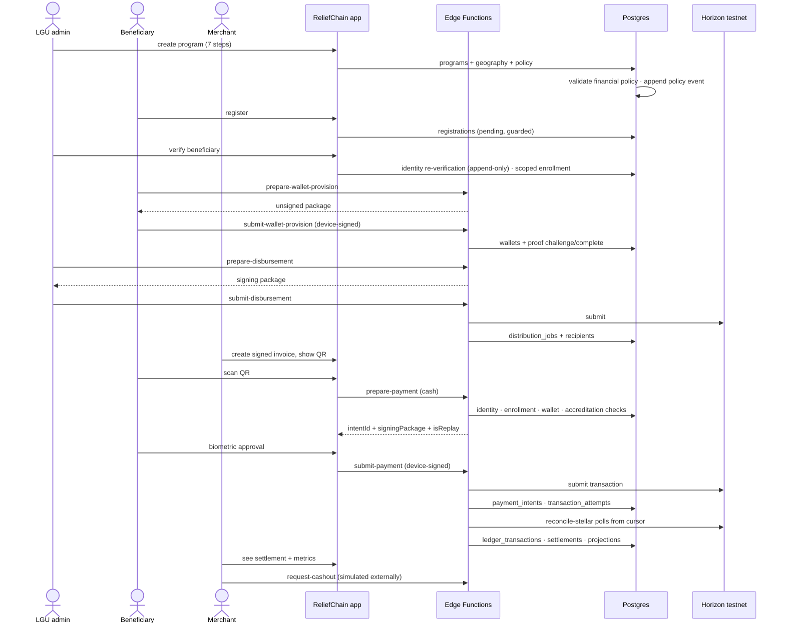
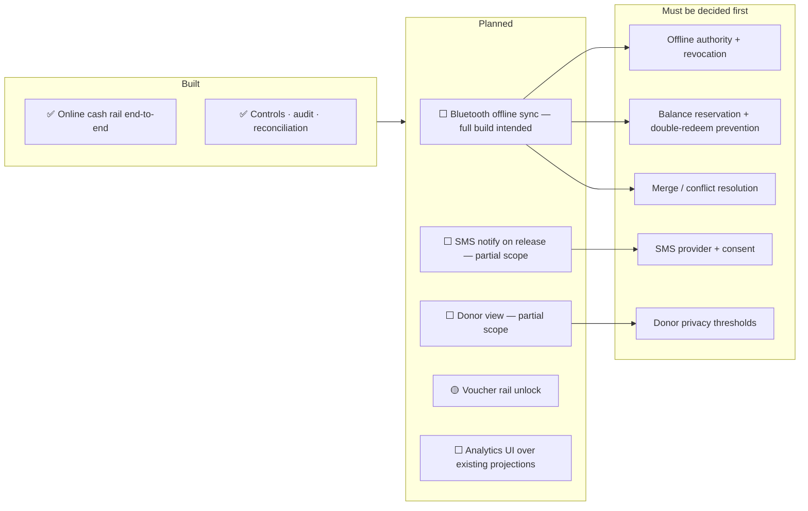

# ReliefChain — App Flow and Feature Scope

**Project:** ReliefChain — Blockchain-Powered Disaster Relief Distribution Platform  
**Date:** 2026-09-24  
**Version:** 1.0  
**Owner:** MINDMESH  
**Status:** Active  
**Source of truth:** [`relief-chain.md`](relief-chain.md)  
**Related:** [BRD](brd-reliefchain.md) · [BPD](bpd-reliefchain.md) · [PRD](prd-reliefchain.md) · [SAD](sad-reliefchain.md) · [SDD](sdd-reliefchain.md) · [DSD](dsd-reliefchain.md) · [Build](build-reliefchain.md)

---

> **Source-of-truth rule.** [`relief-chain.md`](relief-chain.md) is the canonical foundation document. Resolve conflicts there first, then propagate. Agents and developers should read `relief-chain.md`, then the rest of `docs/`, before reading code.
>
> **Purpose of this document.** This is the honest status map: what is wired, what is gated or simulated, and what is only planned. It is the fastest answer to *"what actually works?"* — including in a judge Q&A.

**Legend**

| Mark | Meaning |
|---|---|
| ✅ | Built and wired end-to-end |
| 🟡 | Partial, mocked, simulated, or built-but-gated |
| ⬜ | Planned — no implementation in code |
| ❌ | Out of scope for v1 |

**Operating boundary:** Stellar **testnet** only, asset **RCPHP**, no monetary value. Mainnet raises `StellarConfigurationError` in `shared/stellar-config.ts`.

---

## 1. Role surfaces — what lives where

```mermaid
flowchart TB
  subgraph app [ReliefChain — one Expo binary]
    AU["(auth)"]
    LG["(lgu)"]
    BN["(beneficiary)"]
    MR["(merchant)"]
  end

  AU --> AU1["✅ choose-account · sign-in · sign-up"]
  AU --> AU2["✅ verify-email · registration-success"]
  AU --> AU3["✅ forgot-password"]
  AU --> AU4["✅ application-review — LGU gate"]
  AU --> AU5["✅ terms-and-conditions"]

  LG --> LG1["✅ Dashboard — budget · programs · activity"]
  LG --> LG2["✅ Programs + program/[id]"]
  LG --> LG3["✅ Disbursements (route pay-scan)"]
  LG --> LG4["✅ Beneficiaries — verify · re-verify"]
  LG --> LG5["✅ Settings · edit-profile · security"]
  LG --> LG6["✅ create-program — 7 steps"]
  LG --> LG7["⬜ analytics / report export UI"]

  BN --> BN1["✅ Dashboard"]
  BN --> BN2["✅ My Assistance — entitlements · balance"]
  BN --> BN3["✅ Pay/Scan — camera QR"]
  BN --> BN4["✅ Find Organization"]
  BN --> BN5["✅ Profile · transactions"]
  BN --> BN6["✅ Wallet recovery"]

  MR --> MR1["✅ Dashboard + metrics"]
  MR --> MR2["✅ Receive — signed QR invoice"]
  MR --> MR3["✅ Programs — accreditation"]
  MR --> MR4["✅ Profile · security"]
  MR --> MR5["🟡 Cash-out — externally simulated"]

  style LG7 fill:#3d3520
  style MR5 fill:#3d3520
```



---

## 2. Full product journey

```mermaid
flowchart LR
  subgraph A [A — Onboarding and trust]
    A1["✅ LGU signup + registration review"]
    A2["✅ Beneficiary registration + resubmission"]
    A3["✅ Identity verification / re-verification"]
    A4["✅ Duplicate detection — identity + campaign scope"]
    A5["✅ Merchant registration + accreditation"]
    A6["✅ Wallet provisioning + proof of possession"]
    A7["✅ MFA + step-up"]
  end

  subgraph B [B — Program and funding]
    B1["✅ 7-step program wizard"]
    B2["✅ DB-validated financial policy"]
    B3["✅ Immutable policy events"]
    B4["✅ Treasury funding — testnet RCPHP"]
    B5["🟡 Voucher program activation — contract path gated"]
  end

  subgraph C [C — Distribution]
    C1["✅ 5-step distribute wizard"]
    C2["✅ prepare/submit-disbursement"]
    C3["✅ Per-recipient job tracking"]
    C4["✅ Failure summary per recipient"]
    C5["⬜ SMS release notification"]
  end

  subgraph D [D — Redemption]
    D1["✅ Merchant signed QR invoice"]
    D2["✅ Beneficiary scan + decode"]
    D3["✅ prepare-payment validation chain"]
    D4["✅ Biometric approval + fallback"]
    D5["✅ Device signing + submit-payment"]
    D6["✅ On-chain settlement to merchant"]
    D7["🟡 Voucher-escrow redeem — built, gated"]
  end

  subgraph E [E — Assurance]
    E1["✅ Reconciliation vs Horizon"]
    E2["✅ Chain-evidence coupling triggers"]
    E3["✅ Append-only audit + ledger"]
    E4["✅ Projections — balances · metrics"]
    E5["✅ Refunds · disputes · evidence"]
    E6["✅ Retention + identity disposition"]
    E7["🟡 Public transparency — data only, no UI"]
    E8["⬜ Donor portal"]
  end

  subgraph F [F — Cash edge]
    F1["🟡 Merchant cash-out request"]
    F2["⬜ Real fiat off-ramp"]
  end

  A1 --> A3 --> A4 --> B1 --> B2 --> B4 --> C1 --> C2 --> C3
  A2 --> A3
  A5 --> D1
  A6 --> D2
  C3 --> D2 --> D3 --> D4 --> D5 --> D6 --> E1
  D3 -.-> D7
  E1 --> E2 --> E3 --> E4
  E4 --> E7 -.-> E8
  D6 --> E5
  D6 --> F1 -.-> F2
  C3 -.-> C5

  style B5 fill:#3d3520
  style D7 fill:#3d3520
  style E7 fill:#3d3520
  style F1 fill:#3d3520
```



---

## 3. What happens today — the demonstrable path



---

## 4. Feature scope matrix

| Capability | Priority | Status | Where |
|---|---|---|---|
| LGU signup + registration review gate | Must | ✅ | `registrations`, `create_registration_on_lgu_signup()`, `(auth)/application-review` |
| Role-based routing guard | Must | ✅ | `src/app/_layout.tsx`, `auth-routing.ts`, `lgu-navigation-guard.ts` |
| Beneficiary registration + resubmission | Must | ✅ | `BeneficiaryRegistration/`, `utils/resubmission.ts` |
| Identity verification / re-verification | Must | ✅ | `BeneficiaryVerification/`, `record_beneficiary_identity_reverification()` |
| Duplicate detection | Must | ✅ | `beneficiary_identities`, `disaster_response_campaigns`, scope triggers |
| Merchant registration + accreditation | Must | ✅ | `MerchantRegistration/`, `merchant_accreditations` |
| Program wizard (7 steps) | Must | ✅ | `(lgu)/create-program/*` |
| DB-enforced financial policy | Must | ✅ | `programs_validate_financial_policy` |
| Wallet provisioning + proof | Must | ✅ | `prepare/submit-wallet-provision`, `complete_wallet_proof()` |
| Wallet rotation + recovery | Should | ✅ | `wallet_rotation_intents` (beneficiary), `WalletRecovery/` + `(beneficiary)/wallet-recovery`, contract `rotate_entitlement`; merchant replacement via `prepare/submit-merchant-provision` supersession + `(merchant)/wallet-recovery` |
| Batch disbursement (cash rail) | Must | ✅ | `DistributeAid/`, `prepare/submit-disbursement` |
| QR invoice generation | Must | ✅ | `MerchantInvoice/InvoiceQrCard.tsx`, `shared/invoice-codec.ts` |
| QR scan + validation | Must | ✅ | `PayScan/ScannerView.tsx`, `invoice-scan-service.ts` |
| Payment prepare/submit | Must | ✅ | `prepare-payment`, `submit-payment` |
| Biometric approval + fallback | Must | ✅ | `utils/biometric-auth.ts` |
| MFA + step-up | Must | ✅ | `Mfa/`, `use-step-up.ts`, MFA policy migration |
| On-chain settlement | Must | ✅ | `settlements`, `redemptions`, Horizon submit |
| Reconciliation | Must | ✅ | `reconcile-stellar`, cursors/runs/issues |
| Chain-evidence coupling | Must | ✅ | `*_validate_chain_evidence` triggers |
| Immutable audit trail | Must | ✅ | `audit_events`, append-only triggers |
| Projections | Should | ✅ | four `*_projection` tables |
| Refunds + disputes | Should | ✅ | `refunds`, `disputes`, `dispute_evidence`, contract `refund` |
| Retention + identity disposition | Should | ✅ | retention/disposition migration + functions |
| Merchant metrics | Should | ✅ | `merchant_metrics`, hardened RPC |
| Org dashboard + financials | Must | ✅ | `(lgu)/index.tsx`, `use-organization-financials.ts` |
| Voucher escrow contract | Must | 🟡 gated | `contracts/voucher/`; blocked by cash-only gate in `prepare-payment` |
| Merchant cash-out | Should | 🟡 simulated | `request-cashout`, `SimulatedCashOutNotice.tsx` |
| Public transparency data | Should | 🟡 no UI | `public_financial_transparency`, `auditor_view_*` |
| Analytics / export UI | Should | ⬜ | — |
| SMS notifications | Should | ⬜ partial planned | — |
| Bluetooth offline sync | Should | ⬜ planned build | — |
| Donor portal | Could | ⬜ partial planned | — |
| Mainnet / real money | — | ❌ | hard-disabled |
| AI prediction | — | ❌ | not in scope |
| Hosted Supabase (testnet demo) | Must | ✅ | project `hmbraapdnkoxpepdqgaa`, 52 migrations, 13 Edge Functions, demo accounts seeded — [build](build-reliefchain.md) §15 |
| Hosted production deploy | — | ❌ | mainnet, release signing, monitoring, and incident response remain out of scope (SETUP.md §13) |

---

## 5. The two rails

```mermaid
flowchart TB
  INV["✅ Merchant signed invoice (InvoiceV1)"] --> GATE{"prepare-payment<br/>fundingSourceKind"}
  GATE -->|"'cash' ✅"| CASH["✅ Cash rail<br/>SAC transfer to merchant wallet"]
  GATE -->|"anything else ❌ rejected"| BLOCK["'Only cash funding source<br/>is supported in MVP.'"]
  BLOCK -.->|"unlock work"| VOUCH
  VOUCH["🟡 Voucher rail — VoucherContract.redeem"]
  VOUCH --> VCHK["✅ auth · lifecycle · expiry<br/>✅ contract/sac/network/asset binding<br/>✅ merchant + Ed25519 signature<br/>✅ per-tx · remaining · daily limit<br/>✅ one-time nonce<br/>✅ conservation invariants"]
  CASH --> REC["✅ Reconciliation + audit"]
  VCHK -.-> REC

  style VOUCH fill:#3d3520
  style VCHK fill:#3d3520
```



**Why this matters.** The programmable-voucher claim is the product's headline differentiator, and the enforcement logic genuinely exists and is unit-tested — including conservation invariants and atomic revert. It simply is not reachable from the app while the MVP gate stands. State it that way, precisely, rather than implying either more or less than is true.

**To unlock:** provision `STELLAR_CONTRACT_ADMIN_SECRET` (not created by `bootstrap-topology.mjs`), deploy a contract instance per activated voucher program, add funding-source selection in the client, then lift the gate in `supabase/functions/prepare-payment/index.ts`.

---

## 6. Roadmap items — no code today



**Bluetooth is a new architectural tier, not a screen.** It needs a transport, a trust model, offline authorization that can be revoked, reserved balances, replay protection, and deterministic conflict resolution. Until those are designed ([`relief-chain.md`](relief-chain.md) Q14–Q17), there are no acceptance criteria to build against.

---

## 7. Actor view

```mermaid
flowchart TB
  L["LGU / Organization admin"]
  B["Beneficiary"]
  M["Accredited merchant"]
  A["Auditor"]
  D["Donor"]
  S["Stellar testnet"]

  L -->|"✅ program · verify · disburse · monitor"| APP["ReliefChain"]
  B -->|"✅ register · wallet · scan · approve"| APP
  M -->|"✅ invoice · settle · metrics · refund"| APP
  M -->|"🟡 request cash-out"| APP
  A -->|"🟡 auditor_view_* RPCs — no UI"| APP
  D -.->|"⬜ not implemented"| APP
  APP -->|"✅ submit + reconcile"| S
  S -->|"✅ ledger evidence"| APP

  style D fill:#2b2b2b
```



---

## 8. Verification commands

Status claims in this document are checkable:

```powershell
npm run preflight      # toolchain readiness
npm run lint           # eslint, zero warnings tolerated
npm run type-check     # tsc --noEmit
npm run test:unit      # node --test
npm run test:property  # financial invariant property tests
npm run test:integration  # supabase test db
npm run validate       # full ladder incl. mobile export smoke
```

Setup, seeds, and demo accounts: [`build-reliefchain.md`](build-reliefchain.md).

---

*Update this document in the same change that alters feature status. A stale status map is worse than none, because it gets quoted under questioning.*
