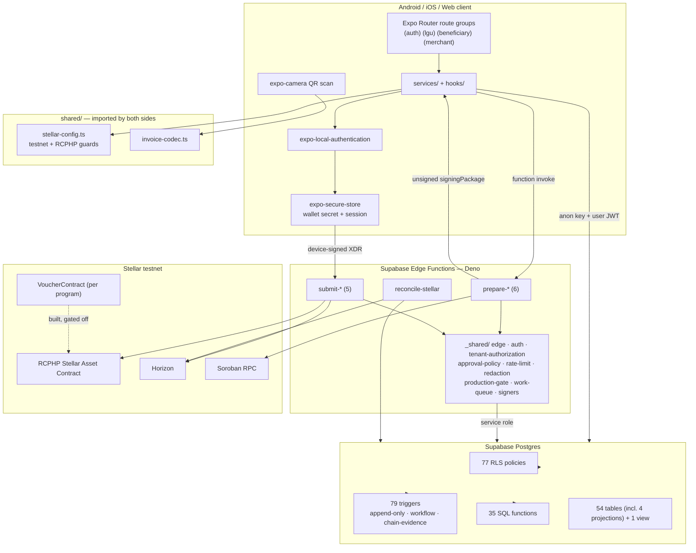
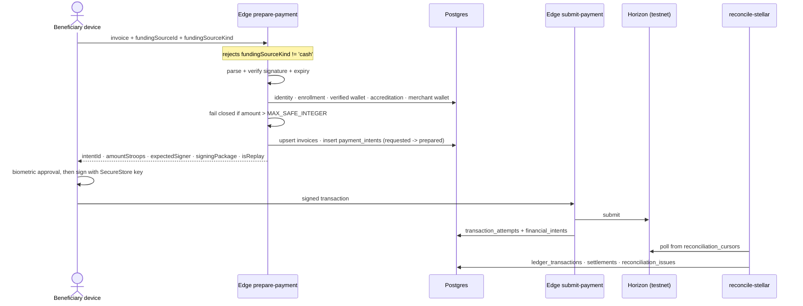

# Software Architecture Document (SAD): ReliefChain

**Project:** ReliefChain — Blockchain-Powered Disaster Relief Distribution Platform  
**Date:** 2026-09-24  
**Version:** 1.0  
**Owner:** MINDMESH  
**Status:** Active  
**Source of truth:** [`relief-chain.md`](relief-chain.md)  
**Related:** [BRD](brd-reliefchain.md) · [BPD](bpd-reliefchain.md) · [PRD](prd-reliefchain.md) · [SDD](sdd-reliefchain.md) · [DSD](dsd-reliefchain.md) · [Flow](flow-reliefchain.md) · [Build](build-reliefchain.md)

---

> **Source-of-truth rule.** [`relief-chain.md`](relief-chain.md) is the canonical foundation document. Resolve conflicts there first, then propagate. Agents and developers should read `relief-chain.md`, then the rest of `docs/`, before reading code.
>
> **This document is as-built.** It describes the architecture that exists in the repository, with file evidence. Where the architecture is intentionally constrained (testnet, cash-only rail), that constraint is part of the architecture and is stated as such.

---

## 1. Architectural Overview

### 1.1 Pattern

ReliefChain is a **client-plus-serverless architecture with an on-chain settlement tier and a database-enforced control plane**. There are four tiers:

1. **Single cross-platform client** — one Expo application serving three roles through route groups, not three separate apps.
2. **Serverless financial API** — Supabase Edge Functions (Deno/TypeScript) implementing a two-phase *prepare/submit* protocol. The server never holds a beneficiary's signing key; it builds an unsigned signing package that the device signs.
3. **Postgres control plane** — Supabase Postgres where authorization, state machines, immutability, and financial invariants are enforced by RLS policies, triggers, and functions rather than by application code alone.
4. **Stellar testnet settlement tier** — the RCPHP Stellar Asset Contract for cash-rail payments, plus one immutable Soroban `VoucherContract` instance per voucher program.

### 1.2 The load-bearing architectural decision

**Trust is placed in the database and the contract, not in the client or the API layer.** Evidence:

- **77 live policies** in `public` (plus 2 on storage), verified by introspecting `pg_policies` on the hosted database. The static count of 113 `create policy` statements over-counts, because later migrations drop and re-create policies. Tenant scoping is concentrated in `20260716040100_scope_private_data_by_organization.sql`.
- 79 triggers, including `*_append_only` / `*_reject_mutation` immutability guards, `*_validate_workflow` state machines on `payment_intents`, `invoices`, `refunds`, `disputes`, `cashout_requests`, `*_validate_chain_evidence` linking workflows to on-chain proof, and `protect_confirmed_financial_history` / `protect_terminal_financial_workflow`.
- `VoucherContract` asserts conservation invariants before and after every value change and reverts the entire invocation on any failure.

A compromised or buggy client cannot violate these rules, because the rules do not live in the client.

### 1.3 Structural breakdown

| Component | Location | Responsibility |
|---|---|---|
| Client app | `src/app/`, `src/components/` | Role-scoped UI, QR capture and display, biometric approval, device-side transaction signing |
| Client data layer | `src/services/` (24), `src/hooks/` (25) | Supabase and Edge calls, projection reads, job polling |
| Client state | `src/context/AuthContext.tsx`, `CreateProgramProvider` | Session and wizard state only — no global store library |
| Shared contracts | `shared/stellar-config.ts`, `shared/invoice-codec.ts`, `shared/fixtures/` | Types and rules imported by **both** client and Edge, so both sides cannot drift |
| Edge Functions | `supabase/functions/` (12 + `_shared/`) | Authorization, validation, orchestration, signer custody, idempotency, reconciliation |
| Database | `supabase/migrations/` (52) | Schema, RLS, state machines, immutability, projections, retention |
| Smart contract | `contracts/voucher/` | Escrowed voucher program with conservation invariants |
| Operational scripts | `scripts/` (46) | Bootstrap, seeds, invocation harnesses, validation runner |

### 1.4 Route-group topology

One binary, three role surfaces, enforced by a redirect guard in `src/app/_layout.tsx` using `src/utils/auth-routing.ts`.

| Group | Navigator | Screens |
|---|---|---|
| `(auth)` | `Stack` | `choose-account`, `sign-in`, `sign-up`, `verify-email`, `registration-success`, `forgot-password`, `application-review`, `terms-and-conditions` |
| `(lgu)` | `Tabs` + `CreateProgramProvider` | `index`, `programs`, `pay-scan` (**Disbursements**), `beneficiaries`, `settings`; hidden `explore`, `create-program`, `edit-profile`, `security`, `program/[id]` |
| `(beneficiary)` | `Tabs` (floating pill) | `index`, `my-assistance`, `pay-scan`, `find-organization`, `profile`; hidden `transactions`, `wallet-recovery` |
| `(merchant)` | `Stack` (`animation: 'none'`) | `index`, `receive`, `profile`, `programs`, `security` — bottom nav is a component, not a navigator |

There is **no `src/app/index.tsx`**. Cold start renders `<Slot />` with no match until the redirect effect resolves, guarded by `hasRedirectedRef`. This is deliberate but fragile; it is listed in [`build-reliefchain.md`](build-reliefchain.md) §8.

---

## 2. Technology Stack

Versions are the declared ranges in `package.json`.

| Layer | Technology | Version | Rationale / trade-off |
|---|---|---|---|
| Client runtime | Expo SDK | `~57.0.4` | One codebase for Android, iOS, and web. Trade-off: SDK-pinned native modules; upgrades are coordinated events |
| | React Native | `0.86.0` | New-architecture baseline for SDK 57 |
| | React | `19.2.3` | `reactCompiler: true` is enabled in `app.config.js` |
| Routing | `expo-router` | `~57.0.4` | File-based routing with `typedRoutes: true`; route groups give role isolation without separate builds |
| Language | TypeScript | `~6.0.3` | Strict typing across client, Edge, and shared modules; `no any` is a project rule |
| Blockchain SDK | `@stellar/stellar-sdk` | `^16.0.1` | Transaction building, XDR, Horizon and Soroban RPC |
| Contract | Rust + `soroban-sdk`, `#![no_std]` | workspace `contracts/` | Enforces escrow invariants where no client can bypass them. Trade-off: no upgrade path by design — a new version is a new deployment |
| Backend | Supabase Edge Functions (Deno) | — | Colocated with the database and auth; keeps signer secrets server-side. Deployment path verified 2026-09-24: 13 functions live on a hosted project with JWT verification on |
| Database + auth | Supabase Postgres + Auth | client `^2.110.2` | RLS as the authorization boundary; triggers as the invariant boundary |
| Camera / QR | `expo-camera` `~57.0.1`, `react-native-qrcode-svg` `^6.3.21`, `react-native-svg` `15.15.4` | — | In-person redemption is the interaction model |
| Device security | `expo-secure-store` `~57.0.0`, `expo-local-authentication` `~57.0.1` | — | Hardware-backed key storage; biometric approval with explicit fallback |
| UI / motion | `@expo/ui` `~57.0.4`, `react-native-reanimated` `4.5.1` + `react-native-worklets` `0.10.0`, `expo-glass-effect`, `expo-linear-gradient`, `expo-image` | — | Native-feeling surfaces; Reanimated 4 requires the worklets package |
| Typography | `@expo-google-fonts/plus-jakarta-sans` `^0.4.2`, `@expo-google-fonts/sarina` `^0.4.1` | — | Plus Jakarta Sans is the system face; Sarina is a display face used in branding |
| Tests | `node --test`, `fast-check` `^4.3.0`, `supabase test db` | — | **No jest and no vitest.** Property tests cover financial invariants |
| Lint | `eslint` `^9`, `eslint-config-expo` `~57.0.0` | — | `--max-warnings=0`. No prettier in the toolchain |

**Stack notes.** `jsonwebtoken` `^9.0.3` is declared as a runtime dependency but is a Node library, almost certainly script-only — flagged in [`build-reliefchain.md`](build-reliefchain.md) §8. `pg` and `supabase` are dev dependencies used by scripts and tests.

---

## 3. Component Communication

### 3.1 Runtime topology

### 3.2 The prepare/submit protocol

Every value-moving operation is two calls. This is the central integration pattern.

Properties this buys: idempotency via `idempotency_keys` and `claim_financial_idempotency_key()`; replay safety via `isReplay`; no server custody of beneficiary keys; and confirmation decoupled from submission, so a dropped connection cannot produce an unknown financial state.

### 3.3 Authorization boundaries

| Boundary | Mechanism |
|---|---|
| Client → Postgres | Supabase Auth JWT + RLS; helpers `is_lgu()`, `is_super_admin()`; `handle_new_user()` creates `profiles` from signup role metadata |
| Client → Edge | Session verification in `_shared/auth.ts`; tenant checks in `_shared/tenant-authorization.ts`; `_shared/approval-policy.ts`; `_shared/rate-limit.ts` |
| Edge → Postgres | Service-role binding via `createEdgeServiceBinding()` — privileged and therefore never exposed to the client |
| Device → chain | `beneficiary.require_auth()` inside the contract; fee sponsorship can never substitute for it |
| Wallet ↔ identity | `issue_wallet_proof_challenge()` / `complete_wallet_proof()`; `wallets_protect_verified_binding` |
| Auditor access | Controlled `auditor_view_*` RPCs rather than table grants |

### 3.4 External integrations

| Integration | Posture |
|---|---|
| Stellar Horizon (testnet) | Origin-allowlisted, HTTPS-only, credential-free URLs; submission plus reconciliation polling |
| Soroban RPC (testnet) | Origin-allowlisted; simulation and contract calls |
| Friendbot | Bootstrap funding only |
| Supabase Auth email | Local Inbucket at `:54324` during development |
| SMS gateway | ⬜ Not integrated |
| Bluetooth peers | ⬜ Not integrated |

---

## 4. Quality Attributes

### 4.1 Service-level objectives

**No SLO is defined.** The repository contains no latency budget, uptime target, throughput target, or error-rate threshold. A hosted testnet environment now exists, but nothing measures it — no monitoring, no load test, no collected latency data. Publishing numbers here would be fabrication.

| Attribute | Target | Status |
|---|---|---|
| Availability | — | **TBD** |
| API latency (p95) | — | **TBD** |
| Disbursement throughput | — | **TBD** |
| Redemption end-to-end time | — | **TBD** |
| Error rate | — | **TBD** |
| Offline continuity window | — | **TBD** (feature not built) |

Before any target is claimed, define the measured event boundaries — in particular whether "settled" means Edge acceptance, Horizon submission, ledger close, or reconciliation confirmation. These are seconds apart and not interchangeable.

### 4.2 Correctness and financial integrity — the strongest attribute

- **Conservation invariants** in `contracts/voucher/src/lib.rs`, checked before and after every value change, with `checked_*` arithmetic and `Error::ConservationViolation`.
- **Atomic revert**: any failed check in `redeem` reverts the whole invocation, so a one-time nonce is consumed only in the same invocation that settles value.
- **Fail-closed validation**: `prepare-payment` rejects amounts beyond `Number.MAX_SAFE_INTEGER` rather than lose precision silently.
- **Immutability**: append-only triggers on `audit_events`, `contract_events`, `ledger_transactions`, `financial_intents`, `dispute_evidence`, `program_policy_events`, `beneficiary_identity_reverifications`.
- **Workflow legality**: `*_validate_workflow` triggers make illegal state transitions impossible, not merely unlikely.
- **Property tests**: `scripts/tests/*.property.test.mjs` cover authorization integrity, confirmation integrity, monotonic auditability, no-duplicate-settlement, policy immutability, and tenant isolation.

### 4.3 Security

- Testnet is hard-enforced; mainnet raises a configuration error.
- No secret in any `EXPO_PUBLIC_*` variable; signer secrets live only in the git-ignored `supabase/functions/.env` generated by `make-functions-env.mjs`.
- Device secrets in `expo-secure-store`; biometric approval via `requestPaymentApproval()` with explicit fallback classification.
- MFA plus step-up for sensitive financial actions, with a `sensitive_financial_action` enum.
- `_shared/redaction.ts` for log hygiene; `_shared/production-gate.ts` and `_shared/operation-switches.ts` as operational kill switches.
- **Demo-mode double gate**: `DEMO_MODE = __DEV__ && extra.EXPO_PUBLIC_DEMO_MODE === 'true'`, so a leaked flag cannot fabricate confirmed payments in a release build.

### 4.4 Privacy

Chain-facing records are pseudonymous by construction: contract events (`funded`, `activated`, `entitlement_allocated`, `merchant_changed`, `redeemed`, `refunded`, `beneficiary_rotated`, `paused`, `resumed`) carry opaque identifiers, and `MerchantAuthorization` is PII-free. Personal data stays in Postgres under RLS, with retention policies, legal hold, and an identity-disposition workflow. **No beneficiary personal data is placed on-chain.**

### 4.5 Scalability

Present: read-optimized projection tables (`program_financial_projection`, `beneficiary_balance_projection`, `merchant_balance_projection`, `distribution_job_projection`) with validation triggers; batch disbursement modeled as a job plus per-recipient rows; reconciliation cursors for resumable polling; `_shared/work-queue.ts`.

Absent: load testing, capacity targets, horizontal scaling posture, and queue-depth monitoring. Disaster-scale behavior is unproven.

### 4.6 Availability and operability

A hosted Supabase project exists as of 2026-09-24 — schema, 13 Edge Functions, secrets, and demo data ([build](build-reliefchain.md) §15.0). Everything around it does not: **no monitoring, no alerting, no incident runbook, no backup strategy, and no on-call owner.** It is a free-tier project, which pauses after roughly a week of inactivity, and the committed Android release configuration is not a production signing setup. Treat operational readiness as **deployed but unoperated**.

---

## 5. Architectural Constraints and Debt

| Constraint | Why it exists | Consequence |
|---|---|---|
| Testnet only, RCPHP only | Pilot safety | No real value; every demo must state this |
| Cash funding source only | `prepare-payment` MVP gate | The programmable-voucher differentiator is not exercisable end-to-end |
| No contract upgrade function | Deliberate design | A fix is a redeploy plus migration of program state |
| UTC daily limits | `SECONDS_PER_DAY` bucketing | Limit windows do not align with Philippine local days |
| No `src/app/index.tsx` | Redirect-driven entry | Initial route depends on an effect; guarded but fragile |
| Anon key is inlined at bundle time | Metro inlines `EXPO_PUBLIC_*` | The hosted project a build points at is fixed in the binary; changing target means rebuilding |
| Free-tier hosted project | No paid plan | Pauses after ~a week idle; no backups; a `db reset --linked` is unrecoverable |
| Stellar testnet resets | SDF operational policy | A reset orphans the RCPHP asset and requires re-bootstrapping and updating identifiers in three places |

Known defects and documentation drift are catalogued in [`build-reliefchain.md`](build-reliefchain.md) §8.

---

## 6. Roadmap Impact on Architecture

| Roadmap item | Architectural work required |
|---|---|
| Bluetooth offline sync ⬜ | A new peer transport tier, an offline authority and revocation model, device attestation, local pending-record store, deterministic merge/conflict resolution, balance reservation, and new Android permissions. This is a **new tier**, not a screen |
| SMS notifications ⬜ | An outbound provider integration with consent, retry, and delivery telemetry; likely an Edge Function plus a queue |
| Donor portal ⬜ | A public read surface over `public_financial_transparency` and `public_program_aggregate_projection` with privacy thresholds; donor accounts would add a fourth role and route group |
| Voucher rail unlock 🟡 | Per-program contract deployment, admin secret provisioning, funding-source selection in the client, and lifting the `prepare-payment` gate |

---

## Self-Check

- [x] Pattern, tiers, and the load-bearing decision are stated with evidence
- [x] Stack versions come from `package.json` with trade-offs
- [x] Communication diagrams reflect the real prepare/submit protocol
- [x] SLOs marked TBD rather than invented
- [x] Constraints and debt listed explicitly
- [ ] SLOs pending an environment to measure
- [ ] Load and capacity characteristics unproven
