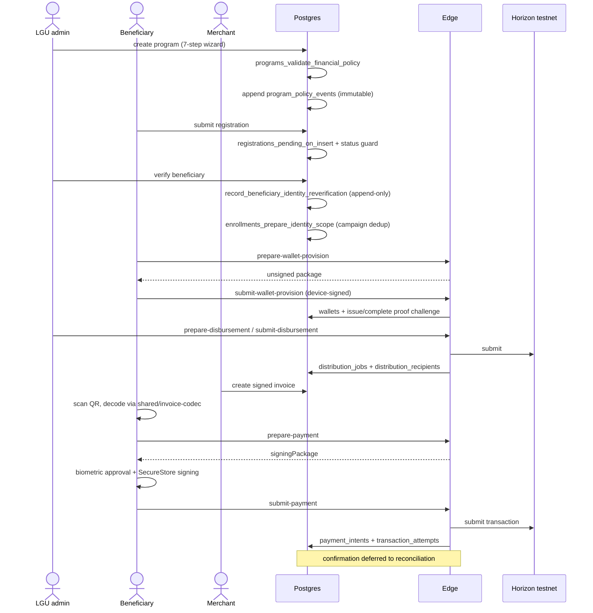
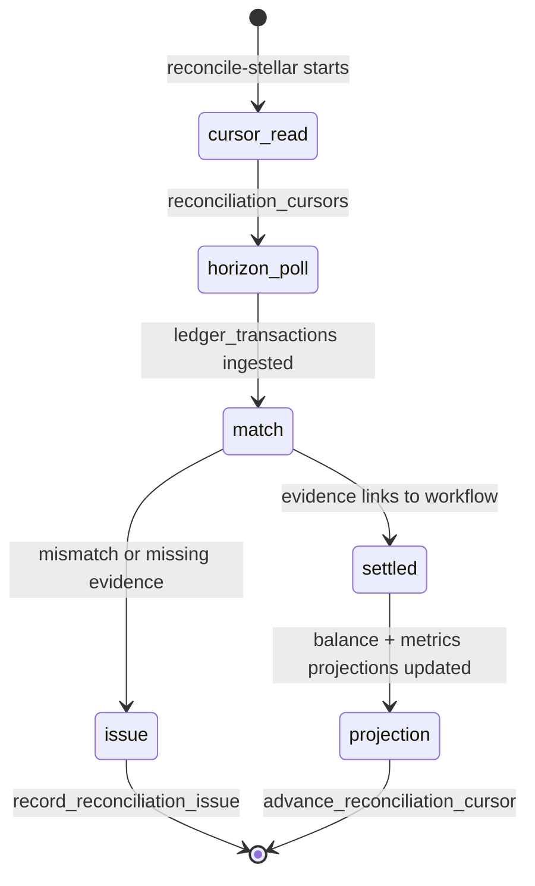

# System Design Document (SDD): ReliefChain

**Project:** ReliefChain — Blockchain-Powered Disaster Relief Distribution Platform  
**Date:** 2026-09-24  
**Version:** 1.0  
**Owner:** MINDMESH  
**Status:** Active  
**Source of truth:** [`relief-chain.md`](relief-chain.md)  
**Related:** [BRD](brd-reliefchain.md) · [BPD](bpd-reliefchain.md) · [PRD](prd-reliefchain.md) · [SAD](sad-reliefchain.md) · [DSD](dsd-reliefchain.md) · [Flow](flow-reliefchain.md) · [Build](build-reliefchain.md)

---

> **Source-of-truth rule.** [`relief-chain.md`](relief-chain.md) is the canonical foundation document. Resolve conflicts there first, then propagate. Agents and developers should read `relief-chain.md`, then the rest of `docs/`, before reading code.
>
> **As-built.** Subsystems, contracts, and schema below exist in the repository. Where a subsystem is gated off or simulated, that is stated inline. **Trust the code over this document wherever they diverge**, and update this document in the same change.

---

## 1. System Components and Subsystems

### 1.1 Client subsystems

| Subsystem | Location | Responsibility |
|---|---|---|
| Auth and routing | `src/context/AuthContext.tsx`, `src/app/_layout.tsx`, `src/utils/auth-routing.ts`, `lgu-navigation-guard.ts`, `signup-routing.ts`, `auth-profile.ts` | Session lifecycle, role→group resolution, LGU registration gating, redirect-loop prevention |
| Registration | `src/components/{OrganizationRegistration,BeneficiaryRegistration,MerchantRegistration,ApplicationReview}/`, `src/services/registrationService.ts`, `src/utils/resubmission.ts` | Multi-step submission, review state, rejection-reason scoping, unlimited resubmission cycles |
| Program authoring | `src/app/(lgu)/create-program/*`, `CreateProgramProvider`, `src/services/programService.ts` | Seven-step wizard: identity → budget → eligibility → documents → schedule → voucher → summary |
| Distribution | `src/components/DistributeAid/*`, `src/services/{distribution-service,disbursementService}.ts`, `src/hooks/use-distribution-job.ts` | Batch disbursement, job progress, per-recipient failure reporting |
| Payment (beneficiary) | `src/components/beneficiary/PayScan/*`, `PaymentReview/*`, `PaymentStatus/*`, `src/services/{invoice-scan-service,payment-service}.ts`, `src/hooks/use-payment-intent.ts` | QR decode, validation, approval, status polling |
| Invoice (merchant) | `src/components/MerchantInvoice/*`, `src/services/invoice-service.ts` | Signed invoice creation and QR display |
| Merchant operations | `src/components/{MerchantDashboard,MerchantPrograms,MerchantProfile,CashOut,Refund}/`, `src/services/{merchantMetricsService,merchantProgramsService,cashout-service,refund-service,pos-adapter}.ts` | Metrics, settlements, cash-out requests, refunds |
| Wallet custody | `src/services/{stellar-wallet-service,stellar-wallet-service-core,wallet-custody-core,wallet-rotation-core,production-wallet-custody,wallet-provision-service}.ts`, `src/components/{WalletProvision,WalletRecovery}/` | Keypair generation, SecureStore custody, provisioning, rotation, recovery |
| Security | `src/components/Mfa/*`, `src/services/mfa-service.ts`, `src/hooks/{use-mfa,use-step-up}.ts`, `src/utils/{step-up,biometric-auth}.ts` | MFA enrollment, step-up challenges, biometric approval with fallback |
| Shared contracts | `shared/stellar-config.ts`, `shared/invoice-codec.ts`, `shared/fixtures/invoice-v1.fixtures.json` | Network/asset guards and the invoice wire format used by **both** client and Edge |

### 1.2 Edge Functions — 13; the 12 value-moving ones are two-phase

| Workflow | Prepare | Submit |
|---|---|---|
| Beneficiary wallet | `prepare-wallet-provision` | `submit-wallet-provision` |
| Merchant wallet | `prepare-merchant-provision` | `submit-merchant-provision` |
| Merchant payment | `prepare-payment` | `submit-payment` |
| Cash program activation | `prepare-cash-activation` | `submit-cash-activation` |
| Disbursement | `prepare-disbursement` | `submit-disbursement` |
| Merchant cash-out | `request-cashout` (single phase) | 🟡 external transition simulated |
| Reconciliation | `reconcile-stellar` (worker) | — |
| Organization sign-up | `lgu-signup` (single phase, no Stellar) | — |

**`lgu-signup`.** The one function outside the two-phase protocol and outside the `_shared` runtime — it imports `@supabase/supabase-js` directly and calls `auth.admin.createUser` with `email_confirm: true`, so organization sign-up skips email OTP without changing the project-wide Auth setting that beneficiary and merchant sign-up depend on. It **forces** `user_metadata.role = 'lgu'` rather than trusting the request body, which stops the pre-confirming path being used for any other role. It does not sign the caller in; `OrganizationRegistrationFlow` follows it with `signInWithPassword`.

> Its source was absent from the repo until 2026-09-24 and existed only as a deployed function on the hosted project, recovered via `supabase functions download`. `verify_jwt` was off; `supabase/config.toml` now pins it to `true`. Because the anon key ships in the client bundle, that check is weak on its own — the real gate is the organization registration review state machine.

**Shared runtime** (`supabase/functions/_shared/`): `edge.ts` (`handleEdgeRequest`, `parseJsonBody`, `createEdgeServiceBinding`, `createEdgeSignerRegistry`, `createEdgeTransactionProtocol`, `EdgeRequestScope`), `runtime.ts` (`serveEdge`), `auth.ts`, `tenant-authorization.ts`, `approval-policy.ts`, `operation-switches.ts`, `production-gate.ts`, `rate-limit.ts`, `redaction.ts`, `response.ts`, `errors.ts` (`FinancialErrorException`), `work-queue.ts`, `wallet-custody.ts`, `wallet-rotation.ts`, `edge-cash-reconciler.ts`.

**Stellar layer** (`_shared/stellar/`): `config`, `network-guard`, `horizon`, `rpc`, `xdr`, `protocol`, `idempotency`, `signers`, `soroban-auth`, `sponsorship`, `invoice`, `merchant-payment`, `distribution`, `cash-activation`, `cash-disbursement`, `cash-reconciliation`, `reconciliation`, `voucher-program`, `voucher-payment`, `voucher-administration`, `voucher-reconciliation`, `wallet-provision`, `ttl-maintenance`.

### 1.3 Database subsystem

52 migrations from `20260713000000_init_schema.sql` to `20260924010000_atomic_recipient_submitted_transition.sql`. The database is a control plane, not a passive store — see §4.

### 1.4 Contract subsystem

`contracts/voucher/` — one `VoucherContract` crate, Rust `#![no_std]` with `soroban-sdk`, modules `lib`, `types`, `storage`, `invoice`, `events`, `error`, `test`. **One immutable instance is deployed per activated voucher program, and there is deliberately no `upgrade` function.**

---

## 2. Reference API Contract

`prepare-payment` is documented in full because it is the canonical shape every other function follows.

**Request** — `POST /functions/v1/prepare-payment`

```json
{
  "invoice": { "...": "InvoiceV1 object per shared/invoice-codec.ts" },
  "fundingSourceId": "<uuid>",
  "fundingSourceKind": "cash"
}
```

**Server sequence** (`supabase/functions/prepare-payment/index.ts`)

1. Require an `invoice` object, `fundingSourceId`, and `fundingSourceKind`.
2. **Reject** any `fundingSourceKind !== 'cash'` — *"Only cash funding source is supported in MVP."*
3. `parseInvoiceObject` → `assertVerifiedInvoice` → `assertNotExpired`.
4. Resolve `beneficiary_identities` by `session.userId`.
5. In parallel: the beneficiary's `enrollments` row with `programs!inner(organization_id)`, and the beneficiary's `wallets` row filtered on `owner_type='beneficiary_identity'`, `purpose='beneficiary'`, `verification_status='verified'`, `is_active=true`, `network='stellar_testnet'`.
6. In parallel: `merchant_accreditations` active and valid across `issuedAt`, and the merchant's `merchant_settlement` wallet.
7. Assert `merchantWallet.address === invoice.settlementWallet`.
8. **Fail closed** if `amountStroops` is not a safe integer.
9. Upsert `invoices` (canonical payload hex, `payload_hash`, signature as bytea hex, status `issued`).
10. Run the merchant-payment orchestrator `prepare()`.
11. Insert `payment_intents` (`requested` → `prepared`) unless replaying.

**Response 200**

```json
{
  "payment": {
    "intentId": "<uuid>",
    "attemptId": "<uuid|null>",
    "amountStroops": "<decimal string>",
    "expectedSigner": "G...",
    "signingPackage": { "...": "unsigned — device signs this" },
    "isReplay": false
  }
}
```

**Errors** — `FinancialErrorException.of(code, message, { correlationId })` with codes `validation_failed`, `authorization_failed`, `dependency_unavailable`. Every response carries a `correlationId`.

**Conventions to preserve in new functions:** parallel dependency fetches; fail-closed numeric validation; idempotency key derived from stable business identity (`makeMerchantPaymentKey(computeInvoiceId(invoice))`); unsigned signing package returned to the device; status transitions written explicitly.

---

## 3. Data Flow

### 3.1 Program creation through redemption (cash rail ✅)



### 3.2 Reconciliation (✅)



Chain evidence is not advisory: `*_validate_chain_evidence` triggers on `payment_intents`, `refunds`, `settlements`, and `voucher_redemptions` require it before those workflows may reach confirmed states (`20260716140000_link_payment_workflows_to_chain_evidence.sql`).

### 3.3 Voucher escrow redemption (🟡 built, gated)

`VoucherContract.redeem(beneficiary, entitlement_id, invoice, merchant_signature)` enforces, in order:

1. `beneficiary.require_auth()` — fee sponsorship can never substitute for it.
2. Lifecycle `Active`; program not past `program_expires_at`; entitlement exists, is active, is owned by the caller, and is unexpired.
3. Invoice binding: `version == 1`, `kind == symbol_short!("voucher")`, `contract_id == current_contract_address()`, `sac == config.sac`, `network == symbol_short!("testnet")` (`Error::WrongNetwork`), `asset_code == config.asset_code`, `amount > 0`, not expired.
4. Merchant: exists, `active`, within `valid_until`, settlement wallet matches, category matches, invoice signer matches, then Ed25519 signature verification.
5. Limits: `per_tx_limit` (0 means unlimited), `entitlement.remaining`, and a rolling daily bucket keyed by `(entitlement_id, now / 86_400)`.
6. One-time nonce unused.

Only then does it move value through the SAC and mark the nonce. Totals are updated with checked arithmetic and `assert_conservation` before persistence.

**Other methods:** `initialize`, `fund`, `activate`, `allocate`, `set_merchant`, `refund`, `rotate_entitlement`, `pause`, `resume`, and read accessors `get_config`, `get_totals`, `get_lifecycle`, `get_entitlement`, `get_merchant`, `get_redemption`. Lifecycle is `Draft → Active → Paused` plus terminal closure.

**Events** (pseudonymous): `funded`, `activated`, `entitlement_allocated`, `merchant_changed`, `redeemed`, `refunded`, `beneficiary_rotated`, `paused`, `resumed`.

**Behavioral notes worth knowing:** `rotate_entitlement` deliberately does **not** reset daily spend, so rotation cannot be used to bypass limits; `pause`/`resume` are explicitly non-seizing; daily buckets are **UTC**, not Philippine local time.

### 3.4 Gate that blocks §3.3

`prepare-payment` rejects non-cash funding sources. Until that gate is lifted and a per-program contract is deployed with `STELLAR_CONTRACT_ADMIN_SECRET` provisioned, §3.3 is reachable only from tests and scripts.

---

## 4. Database as Control Plane

Schema and entity detail lives in this document; [`dsd-reliefchain.md`](dsd-reliefchain.md) covers the design system instead.

### 4.1 Entity groups (54 tables, 1 view, 40 enums)

| Group | Tables |
|---|---|
| Reference geography and taxonomy | `areas`, `barangays`, `cities`, `disaster_types`, `implementing_agencies`, `funding_sources` |
| Identity and access | `profiles`, `registrations`, `registration_access_denials` |
| Tenancy | `organizations`, `organization_memberships` |
| Programs | `programs`, `program_areas`, `program_barangays`, `program_merchants`, `program_policy_events`, `program_financial_projection`, `public_program_aggregate_projection` |
| Beneficiaries | `beneficiary_identities`, `beneficiary_identity_reverifications`, `beneficiary_balance_projection`, `enrollments`, `disaster_response_campaigns` |
| Merchants | `merchant_entities`, `merchant_accreditations`, `merchant_metrics`, `merchant_balance_projection` |
| Wallets | `wallets`, `wallet_rotation_intents` |
| Financial core | `financial_intents`, `transaction_attempts`, `idempotency_keys`, `disbursements`, `distribution_jobs`, `distribution_recipients`, `distribution_job_projection` |
| Payments | `invoices`, `payment_intents`, `settlements`, `redemptions`, `voucher_redemptions`, `refunds`, `cashout_requests`, `disputes`, `dispute_evidence` |
| Chain evidence | `ledger_transactions`, `contract_events`, `reconciliation_runs`, `reconciliation_issues`, `reconciliation_cursors` |
| Governance | `audit_events`, `retention_policies`, `retention_records`, `identity_disposition_requests` |
| View | `public_financial_transparency` |

### 4.2 Enforcement patterns

| Pattern | Trigger family | Effect |
|---|---|---|
| Timestamping | `*_set_updated_at` | Consistent mutation timestamps |
| Immutability | `*_append_only`, `*_reject_mutation` | `audit_events`, `contract_events`, `ledger_transactions`, `financial_intents`, `dispute_evidence`, `program_policy_events`, `beneficiary_identity_reverifications` cannot be edited |
| Legal state transitions | `*_validate_workflow` | `payment_intents`, `invoices`, `refunds`, `disputes`, `cashout_requests` |
| Chain-evidence coupling | `*_validate_chain_evidence` | Confirmed states require ledger proof |
| Tenant scoping | `*_validate_scope` | Cross-organization writes rejected |
| Terminal protection | `protect_confirmed_financial_history`, `protect_terminal_financial_workflow` | Settled history cannot be rewritten |
| Allocation bounds | `enrollments_enforce_program_allocation` | Enrollment cannot exceed program allocation |
| Wallet binding | `wallets_protect_verified_binding` | A verified wallet cannot be silently repointed |
| Projection integrity | `*_projection_validate` | Read models cannot drift into illegal values |

### 4.3 Key functions (35 total)

`handle_new_user`, `create_registration_on_lgu_signup`, `enforce_pending_registration_insert`, `guard_registration_status_transition`, `log_registration_access_denial`, `upsert_organization_membership`, `deactivate_organization_membership`, `replace_program_geography`, `claim_financial_idempotency_key`, `mark_distribution_recipient_submitted`, `issue_wallet_proof_challenge`, `complete_wallet_proof`, `request_wallet_rotation`, `transition_wallet_rotation_intent`, `append_audit_event`, `advance_reconciliation_cursor`, `record_reconciliation_issue`, `record_beneficiary_identity_reverification`, `schedule_retention_record`, `dispose_retention_record`, `replace_retention_policy`, `set_retention_legal_hold`, `request_identity_disposition`, `review_identity_disposition`, `execute_identity_disposition`, `set_identity_disposition_hold`, `finalize_identity_deletion`, `is_lgu`, `is_super_admin`, `auditor_view_approvals`, `auditor_view_reconciliation_report`, `auditor_view_identity_mappings`, `auditor_view_dispute_evidence`.

### 4.4 RLS posture

**77 live policies** in `public`, plus 2 on storage — counted from `pg_policies` on the hosted database, not from migration text. A static grep finds 113 `create policy` statements; the difference is policies dropped and re-created by later repair migrations. Tenant scoping is concentrated in `20260716040100_scope_private_data_by_organization.sql`, then repaired by a visible sequence: `20260717050200_fix_authenticated_read_grants.sql`, `20260717060300_grant_lgu_crud.sql`, `20260717070400_grant_service_role_privileges.sql`, `20260717123300_fix_infinite_recursion.sql`, `20260718000400_fix_profiles_anon_access.sql`, plus merchant read access to beneficiary profiles.

**Do not treat the earliest scoping migration as the effective policy set.** Derive current behavior from the full migration sequence, or from a live introspection of `pg_policies`.

---

## 5. Configuration and Environments

### 5.1 Client variables — `.env` (names only; never commit values)

`EXPO_PUBLIC_SUPABASE_URL`, `EXPO_PUBLIC_SUPABASE_ANON_KEY`, `EXPO_PUBLIC_STELLAR_NETWORK`, `EXPO_PUBLIC_STELLAR_NETWORK_PASSPHRASE`, `EXPO_PUBLIC_STELLAR_HORIZON_URL`, `EXPO_PUBLIC_STELLAR_RPC_URL`, `EXPO_PUBLIC_STELLAR_MAINNET_ENABLED`, `EXPO_PUBLIC_STELLAR_RCPHP_ISSUER`, `EXPO_PUBLIC_STELLAR_RCPHP_SAC_ID`.

`EXPO_PUBLIC_*` values are bundled into the app. **No secret may ever be placed in one.** The two RCPHP identifiers stay blank until asset bootstrap reports them.

### 5.2 Bootstrap secrets — `.env.bootstrap.local` (git-ignored, testnet only)

`STELLAR_ISSUER_SECRET`, `STELLAR_DISTRIBUTION_SECRET`, `STELLAR_SPONSOR_SECRET`, `STELLAR_CONTRACT_DEPLOYER_SECRET`, `STELLAR_CONTRACT_ADMIN_SECRET`, `STELLAR_ORGANIZATION_TREASURY_SECRET`, `STELLAR_CASH_PROGRAM_TREASURY_SECRET`, `STELLAR_BENEFICIARY_SECRET`, `STELLAR_MERCHANT_SECRET`, optional `STELLAR_BOOTSTRAP_SECRET_OUT`.

`scripts/make-functions-env.mjs` derives the git-ignored `supabase/functions/.env` from this file. `STELLAR_CONTRACT_ADMIN_SECRET` is **not** provisioned by `bootstrap-topology.mjs` and must be configured manually for voucher work.

### 5.3 Runtime configuration

`app.config.js`: slug `relief-chain`, scheme `reliefchain`, Android package `com.reliefchain.app`, permissions CAMERA and RECORD_AUDIO, web `output: 'static'`, plugins `expo-router`, `expo-splash-screen` (`#208AEF`), `expo-secure-store`, `@react-native-community/datetimepicker`, `expo-camera`; experiments `typedRoutes` and `reactCompiler`. All nine `EXPO_PUBLIC_*` values are re-exposed through `extra`.

`eas.json`: profiles `development`, `preview`, `production`. See [`build-reliefchain.md`](build-reliefchain.md) §8 for the APK-not-AAB and signing caveats.

**Demo mode:** `DEMO_MODE = __DEV__ && Constants.expoConfig?.extra?.EXPO_PUBLIC_DEMO_MODE === 'true'` (`src/config/demo-mode.ts`). Double-gated so a leaked flag cannot fabricate confirmed payments in a release build.

### 5.4 Environments

| Environment | Reality |
|---|---|
| Local | Supabase CLI via Docker — API `:54321`, Postgres `:54322`, Studio `:54323`, Inbucket `:54324`; Edge served locally |
| Stellar | **Testnet only**, origin-allowlisted, mainnet raises `StellarConfigurationError` |
| Hosted (testnet demo) | **Live** since 2026-09-24 — project `hmbraapdnkoxpepdqgaa`, all 52 migrations applied, 13 Edge Functions deployed with JWT verification on, 16 Function secrets set, demo data seeded. Runbook: [build](build-reliefchain.md) §15 |
| Production | **Does not exist.** No EAS environment variables, no release signing, no monitoring or incident response (SETUP.md §13) |

---

## 6. Error Handling and Observability

- Edge errors are structured `FinancialErrorException`s with a code and a `correlationId` propagated to the response.
- `_shared/redaction.ts` keeps sensitive values out of logs.
- `_shared/production-gate.ts` and `_shared/operation-switches.ts` provide operational gating and kill switches.
- `_shared/rate-limit.ts` throttles abuse paths.
- Failure is surfaced per recipient in distribution (`DistributionFailureSummary`) rather than as one opaque job failure.
- **No centralized logging, metrics, tracing, dashboards, or alerting exists.** Observability is local console output plus database inspection.

---

## 7. AI / Agent Design

No AI or LLM component exists in the runtime. No inference, model call, embedding, vector store, or prediction subsystem is present. Any earlier "AI flood prediction" framing in superseded documents does not describe this system.

---

## 8. Open Design Decisions

These block work and must be resolved in [`relief-chain.md` §14](relief-chain.md), not here.

| Area | Question |
|---|---|
| Offline sync (Q14–Q17) | Transport, device trust, offline authority and revocation, balance reservation, double-redemption prevention, conflict resolution, rejected-record UX |
| SMS (Q18) | Provider, sender identity, consent, retry, delivery telemetry |
| Donor surface (Q19, Q24) | Accounts or anonymous view, privacy thresholds, donation intake and custody |
| Voucher unlock | Funding-source selection, per-program deployment procedure, admin secret custody |
| Fiat edge (Q10, Q12) | What a merchant ultimately receives; cash-out is simulated today |
| Fee mechanics (Q26) | Where the ~1% fee is computed, who is charged, refund and reversal treatment |
| SLOs (Q31, Q32) | Measured event boundaries and targets |
| Localization (Q29) | Supported languages and accessibility commitments |

---

## Self-Check

- [x] Subsystems enumerated with file paths
- [x] A full reference API contract is documented, including the MVP gate
- [x] Data-flow diagrams reflect the real two-phase protocol and reconciliation
- [x] Schema groups, trigger families, functions, and RLS caveats are recorded
- [x] Configuration lists variable names only, never values
- [x] AI section explicitly marked not applicable
- [ ] Request/response shapes for the 11 non-`prepare-payment` functions not yet transcribed
- [ ] Effective RLS policy set should be verified by introspection, not by reading the first scoping migration
